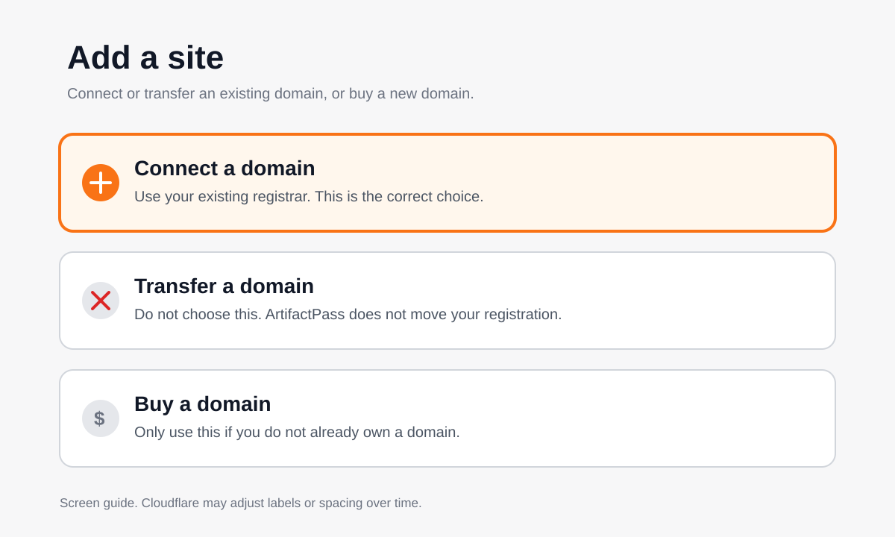
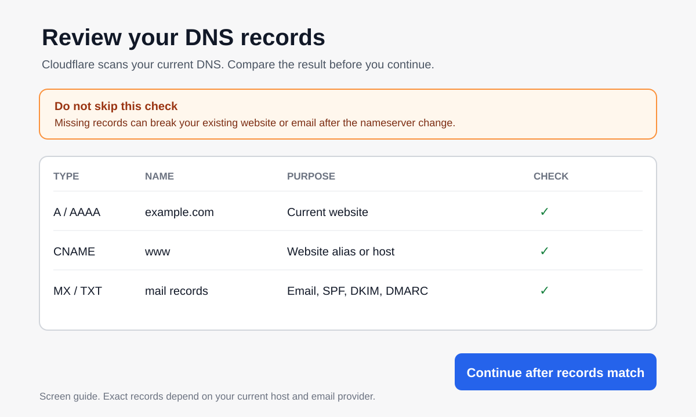
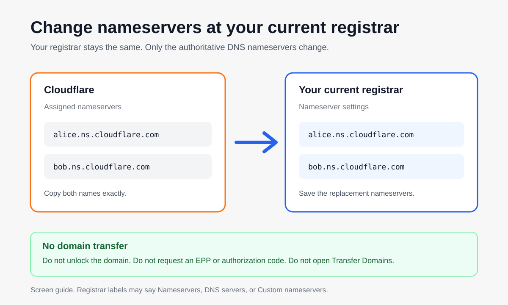

# Connect your domain to Cloudflare

ArtifactPass needs an active domain in the Cloudflare account that will own the private deployment. You are connecting the domain to Cloudflare DNS. You are **not transferring the domain registration to Cloudflare Registrar**.

Your current registrar remains the company that renews and owns the registration. Only the domain's authoritative nameservers change so Cloudflare can manage DNS and attach the ArtifactPass Worker to a hostname such as `artifacts.example.com`.

## What changes and what does not

| Changes | Does not change |
| --- | --- |
| Cloudflare becomes the DNS provider for the domain. | The domain stays registered with the current registrar. |
| The registrar's nameserver fields point to the two nameservers Cloudflare assigns. | You do not unlock the domain. |
| DNS records are managed in Cloudflare after activation. | You do not request an EPP or transfer authorization code. |
| ArtifactPass later creates its own hostname on the domain. | ArtifactPass never receives registrar credentials. |

Cloudflare calls the normal process **Connect a domain**, **Onboard a domain**, or a **primary/full DNS setup**. Do not choose **Transfer a domain**.

## Before changing anything

Have these ready:

- the apex domain, written as `example.com`, without `https://`, `www`, or a path;
- access to the current registrar's nameserver settings;
- the current DNS records for the website and email;
- permission to disable and later re-enable DNSSEC if the registrar currently uses it.

Cloudflare's automatic DNS scan may miss uncommon records. Before changing nameservers, compare Cloudflare's imported records with the current DNS provider. Pay particular attention to:

- the apex `A`, `AAAA`, or `CNAME` record used by the existing website;
- the `www` record;
- email `MX` records;
- email and verification `TXT` records, including SPF, DKIM, and DMARC;
- any custom subdomains already in use.

## 1. Enter the domain in ArtifactPass

When ArtifactPass asks:

```text
Domain to add to Cloudflare (example: example.com; no https://)
```

Enter:

```text
example.com
```

Do not enter `https://example.com`, `www.example.com`, or the future ArtifactPass hostname. The CLI opens Cloudflare's domain onboarding page and prints both the Cloudflare URL and this guide.

## 2. Choose Connect a domain

On Cloudflare's **Add a site** page, select **Connect a domain**.



Do not choose **Transfer a domain**. A transfer moves registration and renewal to Cloudflare, may ask for payment and an authorization code, and is unrelated to ArtifactPass setup.

## 3. Add the apex domain

Enter the same apex domain from the CLI, such as `example.com`. Use Cloudflare's normal onboarding flow to import DNS records. Choose the Cloudflare plan yourself when the dashboard asks. ArtifactPass does not select a plan or accept payment terms.

For a normal Free or Pro account, Cloudflare uses a primary/full DNS setup. That means Cloudflare becomes the authoritative DNS provider after the nameserver change. The registration still stays at the current registrar.

## 4. Review every imported DNS record

Before continuing, compare the Cloudflare DNS table with the records at the current DNS provider or registrar.



Add anything the scan missed. If the existing website or email records are absent when the nameservers change, those services can stop working even though the domain becomes active in Cloudflare.

## 5. Handle DNSSEC before replacing nameservers

If DNSSEC or a DS record is enabled at the current registrar, disable it before replacing the nameservers. Old DNSSEC records refer to the previous DNS provider and can make the domain unreachable after the switch.

After Cloudflare shows the domain as Active, enable DNSSEC in Cloudflare and follow Cloudflare's instructions to publish the new DS record at the registrar.

If DNSSEC is not enabled, skip this step.

## 6. Replace nameservers at the current registrar

Cloudflare assigns two nameservers. Copy both values exactly.

At the current registrar, open **Nameservers**, **DNS servers**, or **Custom nameservers**. Remove the old authoritative nameservers and replace them with the two Cloudflare values.



This is not a transfer:

- do not unlock the domain;
- do not request an EPP or authorization code;
- do not open Cloudflare's Transfer Domains page;
- do not change the registrant, renewal, or billing owner.

## 7. Wait for Cloudflare to show Active

Return to Cloudflare and wait for the domain status to change from **Pending** to **Active**. Activation often takes a few minutes but can take up to 24 hours.

Return to the ArtifactPass terminal and choose:

```text
Check again
```

ArtifactPass continues only after the selected Cloudflare account reports the domain as Active.

## If the domain is already active in Cloudflare

Select it from the domain list in the CLI. Do not onboard it again and do not change nameservers. ArtifactPass records the existing zone and continues to the next prerequisite.

## If the domain stays pending

Check these items:

1. The registrar lists exactly the two nameservers Cloudflare assigned.
2. No old or additional nameservers remain.
3. DNSSEC or old DS records are disabled during the change.
4. The domain was added to the same Cloudflare account authorized in ArtifactPass.
5. The registrar has had enough time to publish the update.

If the registrar does not allow nameserver changes, the standard ArtifactPass private-deployment wizard cannot activate that domain. Do not start a registrar transfer just to get past the screen. Resolve the registrar limitation first or use another domain you control.

## Official Cloudflare references

- [Onboard a domain](https://developers.cloudflare.com/fundamentals/manage-domains/add-site/)
- [Set up a primary zone and change nameservers](https://developers.cloudflare.com/dns/zone-setups/full-setup/setup/)
- [Update nameservers](https://developers.cloudflare.com/dns/nameservers/update-nameservers/)
- [Transfer a domain to Cloudflare](https://developers.cloudflare.com/registrar/get-started/transfer-domain-to-cloudflare/), shown only to explain the separate process ArtifactPass does not require
