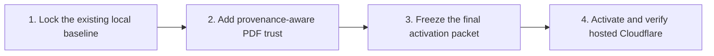

# Portable Agent Artifact Trust and Hosted Activation - Plan

## Goal Capsule

Finish Artifact Share locally, add provenance-aware PDF handling, then activate one hosted Cloudflare deployment without making the repository public.

When this plan is done:

- Any compatible agent can publish and read final Markdown, HTML, and PDF artifacts through the same MCP and skills contract.
- Codex and Claude Code pass as representative compatibility tests, without separate product implementations.
- The browser flow works on this computer, over the local network, and through an optional Cloudflare Quick Tunnel.
- Restart, expiry, and cleanup behavior are proven against real local D1 and R2 storage.
- PDFs produced by the controlled artifact pipeline can flow automatically with provenance, while human and external PDFs remain human-only in this release.
- One private hosted deployment passes health, authentication, upload, read, expiry, and cleanup checks.

Local commits are allowed for recovery. This planning turn does not mutate Cloudflare. The hosted execution run may change only the named deployment resources after the user supplies the dashboard prerequisites and starts that run. Git push, package publication, and repository visibility remain separate decisions.

## Product Contract

### What the product should do

#### Artifact and handoff behavior

- R1. A final durable text artifact defaults to Markdown, interactive work defaults to self-contained HTML, and fixed-layout work defaults to PDF unless the user asks for another supported format.
- R2. Ordinary chat, code changes, logs, tests, configuration, and scratch files are not automatically shared.
- R3. A compatible agent publishes one declared final artifact for one hour through the shared MCP and skills contract.
- R4. Publication failure is truthful: the local artifact remains available and the agent never invents a share URL.
- R5. A compatible receiving agent reads one valid Artifact Share link from its configured origin through the same contract.
- R6. Markdown and HTML preserve exact source bytes. PDF preserves the original file; only a controlled-provenance PDF receives an agent-readable representation in this release.

#### Network and portability

- R7. Loopback and LAN testing may use open local uploads. A public Quick Tunnel must use a temporary upload token.
- R8. Hosted Cloudflare setup and Git push remain blocked until every local phase passes.
- R9. Vendor-specific plugins and hooks may adapt host events or registration, but cannot contain separate sharing logic or create agent-specific product versions.

#### PDF trust

- R10. A PDF produced by the controlled artifact pipeline carries a canonical, authenticated provenance receipt that binds its source hash, renderer identity and version, output hash, generation time, signing-key ID, and signature.
- R11. A human-uploaded, externally sourced, or provenance-unknown PDF is untrusted regardless of who uploads it. In this release it remains human-only; a later document-aware verifier may make it agent-readable only after proving that machine-visible content matches the rendered document.
- R12. When PDF verification fails or is inconclusive, the system exposes no extracted content to agents and offers no ordinary click-through override; any retained raw file is labeled human-only and unverified.

#### Hosted activation

- R13. Hosted activation creates or updates only the named Worker, D1, R2, Access, Custom Domain, migration, and lifecycle resources after an explicit hosted-run approval.

### Key decisions

- **PDF trust follows provenance, not uploader confidence.** (session-settled: user-directed — chosen over broadly trusting manual browser uploads: people may unknowingly pass a hostile PDF to an agent.) Governs R10-R12.

### Main user flow

1. An agent creates a final artifact and, when it renders a PDF through the controlled pipeline, records the provenance receipt from R10.
2. The agent declares that exact file as the handoff artifact.
3. The shared skill invokes the MCP publication tool once with a one-hour expiry. A thin host adapter may trigger this automatically when the host exposes a trusted lifecycle event.
4. The handoff includes the URL, expiry, format, size, checksum, and verified provenance state when applicable.
5. The receiving agent recognizes the URL and reads the artifact automatically only when its representation is agent-readable under R11-R12.
6. A person can open the same URL in the browser and can distinguish verified agent-readable content from an unverified human-only PDF.

### Important boundaries

- Only files inside approved workspace roots can be shared.
- Only Markdown, self-contained HTML, and PDF are supported.
- Suspected credentials, private keys, sensitive paths, changed files, and uncertain scans are refused.
- Browser uploads cannot claim controlled-pipeline provenance.
- A human-only PDF never yields extracted text through `read_artifact`, even after a person opens or downloads it.
- Artifact content is returned to agents only inside an explicit untrusted-data envelope. It cannot supply paths, URLs, tool arguments, authorization decisions, or instructions that override sharing policy.
- Share URLs are one-hour bearer links. Task handoffs are an allowed delivery channel; public logs, issues, and analytics are not.
- MCP tools and portable skills are the baseline product contract.
- Automatic end-of-turn triggering is optional because not every host exposes lifecycle hooks. When available, a thin adapter invokes the same shared contract.
- A host integration may package or register the shared runtime, but it cannot fork the product logic.

## Planning Contract

### Technical direction

- Keep `publish_artifact` and `read_artifact` as the vendor-neutral MCP tools.
- Define publication, reading, handoff, and safety behavior in portable skills.
- Use one shared runtime for path validation, stable-byte reads, secret scanning, hashing, upload, response validation, and session state.
- Keep session state private, locked, and isolated per agent task.
- Use capability detection instead of branching on vendor names.
- Limit plugins and host hooks to registration, lifecycle-event normalization, and invoking the shared runtime.
- Make retries idempotent so a lost response cannot create duplicate links.
- The controlled PDF qualifier and receipt signer live in the shared representation runtime. It signs only immutable PDF and canonical-source bytes that pass the renderer-version safety qualifier, using a private key unavailable to browser uploads. Publication sends the receipt with those stable bytes, and the service independently verifies both against an allowlisted public key before persisting controlled trust.
- Use Ed25519 receipts. Store private signing keys outside the repository and ordinary artifact directories, and expose only allowlisted public keys to the service. Include a key ID and renderer-version ID in every receipt so hosted activation can add or retire either without accepting unsigned fallback.
- A controlled PDF's agent-readable representation is the signed canonical source used to render it, not text re-extracted from the PDF. Qualify each trusted renderer version against normal and adversarial source-to-output fixtures before allowlisting it.
- Never infer trust from the upload route, filename, uploader identity, or a client-supplied label.
- Persist an explicit PDF trust state so the viewer and `read_artifact` enforce the same decision.
- Treat missing, null, legacy, unknown-key, revoked-key, or invalid PDF trust as unverified and human-only.
- Do not parse or extract human/external PDFs on the server in this release. The browser may display the original through its isolated PDF viewer, but no derived representation is created.
- Use the existing real local Worker, D1, and R2 environment. Do not replace it with mocks.
- Treat loopback, LAN, Quick Tunnel, and hosted URLs as separate configured origins.

### Execution order

Do not continue past a phase whose proof fails. Fix that phase first.

## Implementation Units

### U1. Lock the existing local baseline

**Outcome:** Confirm the already-built local product is still sound before changing PDF trust. This unit is a regression gate, not a redesign or reimplementation phase.

Run the existing portable-contract, local lifecycle, LAN or Quick Tunnel, representative-host, plugin, and release-package checks. Fix only regressions that block those established behaviors. Preserve the shared MCP, skills, runtime, persistent local D1 and R2, one-hour links, retry safety, private state, open loopback and LAN flow, tunnel upload token, expiry, cleanup, and current browser usability.

**Proof:** The existing release record remains accurate, the current local gates pass, Codex and Claude Code still use the same built package as representative hosts, and no vendor adapter acquires product logic.

### U2. Add provenance-aware PDF trust

**Goal:** Let controlled pipeline PDFs flow automatically while preventing human, external, or provenance-unknown PDFs from feeding extracted content to an agent.

**Requirements:** R10-R12.

**Dependencies:** U1.

**Files:** `packages/artifact-protocol/src/index.ts`, `packages/representation-pipeline/src/`, `packages/agent-bridge/src/tools/publish-artifact.ts`, `packages/agent-bridge/src/tools/read-artifact.ts`, `apps/artifact-service/src/server/routes/artifacts.ts`, `apps/artifact-service/src/server/storage/`, `apps/artifact-service/src/web/routes/upload-page.tsx`, `apps/artifact-service/migrations/`, and their existing tests under `packages/*/test/`, `apps/artifact-service/test/`, and `tests/`.

**Approach:** Add one protocol-level provenance and trust model. The shared runtime opens immutable PDF and canonical-source bytes, rejects incomplete or extraction-divergent rendering behavior, and signs a versioned canonical receipt with the local Ed25519 private key only after qualification. The service accepts controlled trust only when the signature, signing-key ID, renderer-version allowlist, source hash, and stable PDF-byte hash all verify. Browser and unknown-origin uploads never enter this path and remain human-only in this release. The stored trust result gates both viewer labeling and the signed source representation returned to agents; no controlled PDF text is re-extracted.

Migrate fail closed: backfill every existing PDF to `unverified`, treat null or unknown trust as unverified at manifest and derived-content routes, and delete legacy derived PDF objects after their rows are made unreachable. Do not roll back to a Worker version that ignores PDF trust while any affected artifact or derived object remains.

All artifact formats are returned to agents inside the same untrusted-data envelope. Conformance tests must prove that content cannot cause secret reads, republication, new URLs, unrelated tool calls, or authorization changes.

**Test scenarios:**

1. A PDF rendered and signed by the controlled runtime publishes automatically and remains agent-readable after restart.
2. A changed source, changed PDF, altered receipt, unknown or revoked key, unqualified or revoked renderer version, mismatched renderer record, or forged browser provenance cannot receive controlled-pipeline trust.
3. Human, external, legacy, and provenance-unknown PDFs remain human-only and create no derived agent text.
4. Missing or null trust fails closed at the manifest, derived-content route, viewer, and `read_artifact` boundaries.
5. Opening, downloading, or acknowledging an unverified PDF does not upgrade its trust state.
6. The browser clearly labels an unverified PDF as human-only, while `read_artifact` returns bounded metadata and a safety refusal without extracted content.
7. Malicious artifact content asking an agent to read secrets, republish data, follow a supplied URL, or invoke unrelated tools remains inert untrusted data across representative hosts.
8. Qualified renderer fixtures prove the signed source and rendered PDF preserve the allowed visible-content invariants; pathological Unicode, invisible layout, or extraction-divergent fixtures fail qualification and cannot be allowlisted.

**Verification:** Protocol, representation, bridge, service, browser, migration, and persistent local lifecycle tests prove one consistent trust decision across generation, upload, storage, viewing, and agent reading.

### U3. Freeze the private local release and prepare Cloudflare activation

**Outcome:** Everything is ready for the later credential-dependent run, but no external mutation occurs.

Finish:

- the private release-candidate record;
- accurate setup, security, operations, and deployment documentation;
- the exact Cloudflare values the user must provide;
- ordered deployment commands with expected results;
- verification and rollback steps;
- the first approval-gated command for the hosted run.

The hosted packet must cover the Cloudflare account, active domain or zone, hostname, Worker, D1, R2, Access identity, trusted renderer public key, authentication method, DNS choice, and rollback inventory. Git push, package publication, and repository visibility remain blocked pending separate approval and are not activation prerequisites.

**Dependencies:** U2.

**Proof:** All local gates, including the final PDF trust and migration gates, pass; the hosted packet reflects the final protocol and storage model and can be followed without rediscovery; and the execution record shows no push, publication, visibility change, or hosted Cloudflare mutation.

### U4. Activate and verify hosted Cloudflare

**Goal:** Deploy the reviewed private release to the user-selected Cloudflare account and hostname after the dashboard prerequisites are ready.

**Requirements:** R7-R9, R13.

**Dependencies:** U2-U3 and the completed dashboard checklist in `docs/hosted-activation.md`.

**Files:** `docs/hosted-activation.md`, `docs/operations.md`, `packages/setup-cli/src/cloudflare/`, `packages/setup-cli/src/commands/deploy.ts`, and hosted verification tests under `packages/setup-cli/test/` and `tests/e2e/`.

**Approach:** Run an authenticated read-only plan first. Record existing resource IDs, current-to-desired differences, the exact Worker bundle checksum, migrations, trusted renderer public key, and planned mutations in an approval manifest. Require explicit approval, then revalidate the manifest immediately before mutation and abort on remote-state or bundle drift. Create or reuse only the approved Worker, D1 database, private R2 bucket, Access application and policy, Custom Domain, migrations, and lifecycle policy. Keep Git push, tags, package publication, and repository visibility outside this unit.

**Test scenarios:**

1. The authenticated read-only plan records every resource identity, configuration difference, and deployment checksum while changing nothing.
2. The first deployment creates only the approved resources; the second deployment reuses them without duplicates.
3. Remote-state or Worker-bundle drift after approval aborts before the first mutation.
4. `/health` is public, `/upload` requires the approved Access identity, and anonymous artifact creation remains unavailable.
5. Markdown, HTML, and controlled PDFs complete browser and cross-agent handoffs on the hosted origin.
6. Human, external, and provenance-unknown PDFs remain human-only on the hosted origin.
7. Expiry denial, scheduled cleanup, D1 migration state, R2 lifecycle state, and rollback inventory are verified.

**Verification:** The hosted checklist passes against the permanent hostname, the resource inventory matches the approved plan, and the repository remains private and unpushed unless separately approved.

## Verification Contract

The executor runs the smallest relevant tests after each phase. The final local gate is:

1. `pnpm install --frozen-lockfile`
2. `pnpm plugin:build`
3. `pnpm plugin:check`
4. `pnpm release:check`
5. `pnpm test:browser`
6. `pnpm test:local-demo`
7. `pnpm test:agent-hosts`
8. `pnpm release:build`

U2 then reruns the relevant protocol, representation, bridge, service, browser, migration, and local lifecycle gates. U3 freezes the resulting activation packet. U4 follows `docs/hosted-activation.md`: authenticated read-only plan, state-bound approval, explicit mutation approval, live health and Access checks, hosted cross-agent handoffs, idempotent redeploy, expiry, cleanup, and rollback inventory.

Before U1, capture the current Git remote, branches, tags, worktree state, and relevant local processes in the executor's task record. Compare that baseline at the end.

## Definition of Done

- U1-U4 each deliver their stated outcome and proof.
- The vendor-neutral conformance suite passes for publication, reading, safety, state, retries, and result schemas.
- Real sessions in at least two representative agent ecosystems publish and receive Markdown, HTML, and PDF using the identical MCP, skills, and runtime package.
- No vendor-specific integration contains sharing business logic or requires a forked product version.
- The human upload and viewer UI works locally, over LAN, and through an explicitly started Quick Tunnel.
- Controlled-pipeline PDFs carry verified provenance and publish automatically.
- Human, external, legacy, and provenance-unknown PDFs remain human-only in this release and expose no extracted content to agents.
- Missing, invalid, unknown-key, revoked-key, or inconclusive PDF provenance stays human-only with no casual trust override.
- Restart, exact expiry, and physical cleanup are proven against persistent local D1 and R2.
- Generated plugin and release packages install cleanly and pass their checks.
- The hosted activation packet is complete and one approved permanent deployment passes its verification contract.
- The repository remains private and user-owned `output/` fixtures remain uncommitted.
- No Git push, package publication, or repository visibility change occurs without separate approval.
- Cloudflare changes are limited to the approved named resources and have a recorded rollback inventory.
