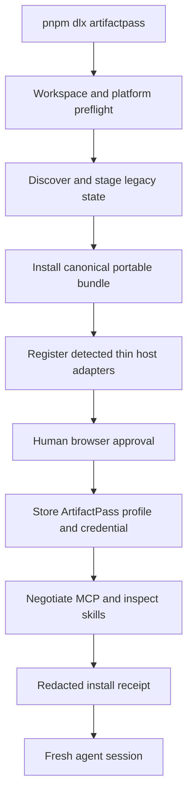
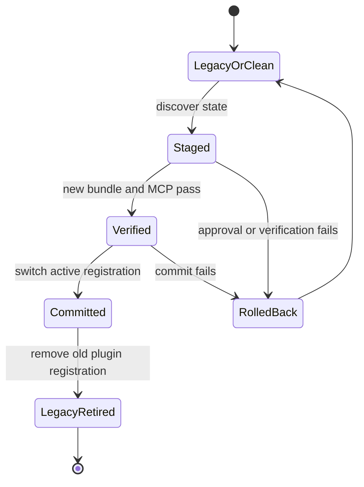

# ArtifactPass Rename and One-Command Installation - Plan

## Goal Capsule

- **Objective:** A new or existing user can run one ArtifactPass command and finish with the shared MCP and skills installed, connected, and verified on every detected supported agent host.
- **Means:** Migrate user-facing identity to ArtifactPass, preserve stable internal compatibility identifiers, and extend the existing setup CLI into an idempotent installer with transactional recovery (KTD1-KTD4).
- **Authority:** The Product Contract governs behavior. Existing security and protocol contracts govern compatibility. The implementation units govern sequencing.
- **Execution profile:** Complete local rename and installer proof first. Package publication, GitHub repository rename, and production deployment remain separate approval boundaries.
- **Stop conditions:** Stop before a migration that would invalidate an existing share, credential, publication journal, controlled-PDF receipt, or live Cloudflare resource. Stop before an external mutation whose reviewed artifact or remote state has drifted.
- **Tail ownership:** The following behavioral-evals phase consumes the install verification receipt defined here. It does not need to rediscover installation state.

---

## Product Contract

### Summary

ArtifactPass replaces Artifact Share as the public product identity. The existing portable MCP, skills, bridge, and setup machinery become one installable product whose default command connects the current workspace to `https://artifactpass.com` and verifies the resulting agent integration.

### Problem Frame

The working product still exposes several names: Artifact Share, `lordebuilds.artifacts.share`, `artifact-share`, `@artifact-share/setup`, and `lordebuilds-artifacts`. The installer already performs most setup work, but its package is unpublished, its no-argument command only prints help, and unknown hosts fail instead of receiving the portable integration. A broad string replacement would break live credentials, retry journals, signed PDF receipts, plugin registrations, and Cloudflare data bindings.

Installation and agent quality are the release promise. The rename must therefore produce one coherent ArtifactPass identity without creating vendor-specific product implementations or losing the working production state.

### Key Decisions

- **ArtifactPass is the canonical product identity.** (session-settled: user-directed — chosen over retaining Artifact Share: the product should match `artifactpass.com`.) Governs R1-R3.
- **Installation is one command over one portable agent contract.** (session-settled: user-directed — chosen over separate MCP, skill, and host setup: installation is part of the product's core selling point.) Governs R6-R13.
- **Rename and installation precede behavioral evals.** (session-settled: user-directed — chosen over building evals against the legacy install surface: evals need a stable released identity and repeatable setup boundary.) Governs R14-R15.
- **Agent systems share product logic.** (session-settled: user-directed — chosen over agent-specific product versions: MCP and Agent Skills are the portable contract, while host adapters only register it.) Governs R10-R13.

### Actors

| ID | Actor | Need |
|---|---|---|
| A1 | New ArtifactPass user | Install and connect a supported agent from one command. |
| A2 | Existing pre-release user | Migrate without losing credentials, profiles, retry state, or controlled-PDF capability. |
| A3 | Compatible agent host | Receive the same MCP tools, skills, runtime bytes, and active connection context. |
| A4 | Human approver | Review and approve the device connection in the browser. |
| A5 | Release operator | Publish and deploy only reviewed, state-bound artifacts. |

### Requirements

#### Identity and compatibility

- R1. Active user-facing product copy, package metadata, CLI output, plugin metadata, documentation, and release artifacts use `ArtifactPass` or `artifactpass` consistently.
- R2. The canonical package and executable are `artifactpass`; the canonical plugin, marketplace, MCP registration key, and generated skill namespace use `artifactpass`.
- R3. The vendor-neutral MCP tool names remain `publish_artifact` and `read_artifact`.
- R4. New clients read legacy configuration, environment variables, credential-store entries, plugin registrations, and publication journals, then migrate state atomically and write only the new ArtifactPass form.
- R5. Existing `/a/` links, Worker/D1/R2 data, publication commitments, controlled-PDF receipts, profiles, and pending retries remain valid throughout the rename.

#### One-command installation

- R6. Running `pnpm dlx artifactpass` with no arguments starts the production connection flow for `https://artifactpass.com` and authorizes the resolved current workspace.
- R7. The installer detects supported hosts, installs or updates the byte-identical portable bundle, activates the production profile, negotiates both MCP tools, and reports the result. It opens browser approval and stores a new scoped credential only when authorization or permission expansion is required; otherwise it validates and preserves the existing valid credential.
- R8. Browser device approval, OAuth consent, credential entry, and permission expansion remain human-only actions.
- R9. Re-running the command repairs or upgrades the installation without duplicate MCP servers, skill namespaces, profiles, or credentials.
- R10. Codex and Claude adapters contain registration logic only and expose the same portable files and tool schemas.
- R11. When no automatic host adapter is available, the command installs the portable bundle and returns its MCP and Agent Skills registration paths instead of failing or claiming automatic registration.
- R12. The default workspace must resolve to a real, specific directory; filesystem roots and the user's home directory are refused unless a future explicit safety design authorizes them.
- R13. A failed host install, canceled approval, token exchange failure, config write failure, or smoke-test failure restores the last known working registration and local state.

#### Eval and release boundary

- R14. Installation emits a redacted machine-readable receipt containing the product version, profile, origin, authorized workspace roots, installed adapter names, portable bundle digest, MCP negotiation result, migration actions, and restart requirement.
- R15. The later behavioral-evals phase can create a clean installation, inspect the receipt, start a fresh host session, and remove that installation without vendor-specific product logic.
- R16. Registry publication, GitHub repository rename, and production Worker deployment occur only after their separate reviewed approval gates; they never rename or replace live D1, R2, Access, signed-protocol, or migration identifiers as a branding side effect.

### Key Flows

- F1. **Fresh supported-host install**
  - **Trigger:** A1 runs the default command from a project directory.
  - **Actors:** A1, A3, A4.
  - **Steps:** The installer validates the workspace, stages the portable bundle, registers detected adapters, opens approval, stores the connection, negotiates the MCP tools, and returns one receipt.
  - **Outcome:** A fresh agent session exposes the ArtifactPass skills and tools against the production origin.
  - **Covered by:** R6-R10, R12-R14.
- F2. **Legacy install migration**
  - **Trigger:** A2 runs the command with old config, credentials, journal state, or plugin registration present.
  - **Actors:** A2, A3.
  - **Steps:** The installer discovers legacy state, stages the new state, verifies the new runtime, switches the active registration, and retires the old registration.
  - **Outcome:** Existing connection and retry behavior continues under ArtifactPass without duplicate tools.
  - **Covered by:** R1-R5, R9, R13.
- F3. **Portable fallback**
  - **Trigger:** A1 has no detected automatic host adapter.
  - **Actors:** A1, A3.
  - **Steps:** The installer completes connection and portable installation, then returns exact registration paths and capability status.
  - **Outcome:** The user receives the same portable contract and truthful remaining registration action.
  - **Covered by:** R10-R11, R14-R15.
- F4. **Failed or canceled install**
  - **Trigger:** Any staged operation fails before final verification.
  - **Actors:** A1 or A2, A4.
  - **Steps:** The installer revokes newly issued credentials where necessary, removes incomplete new state, restores the previous working registration, and reports the failed stage without secrets.
  - **Outcome:** No half-installed or less-secure state remains.
  - **Covered by:** R8, R13-R14.

### Acceptance Examples

- AE1. **Covers F1.** Given a clean supported macOS or Linux host in a project directory, when the user runs `pnpm dlx artifactpass` and approves the browser code, then a fresh host session exposes exactly one ArtifactPass MCP server and both ArtifactPass skills.
- AE2. **Covers F2.** Given an existing production profile, legacy keychain entry, and unacknowledged publication attempt, when the user runs the installer, then the new installation can retry the same attempt without creating a second link.
- AE3. **Covers F2.** Given both old and new plugin identifiers are visible during staging, when the new MCP runtime passes its smoke test, then the legacy registration is removed and only the new skill namespace remains after restart.
- AE4. **Covers F3.** Given no known host CLI is installed, when the user runs the command, then connection succeeds, the portable bundle is installed, and the receipt marks host registration as required instead of reporting full completion.
- AE5. **Covers F4.** Given a working legacy installation, when browser approval is canceled or the new MCP server fails to negotiate, then the legacy installation remains usable and no new credential or config is left active.
- AE6. **Covers R5.** Given a share link and controlled PDF created before the rename, when the new bridge reads them, then their existing trust and content behavior is unchanged.
- AE7. **Covers R14-R15.** Given a successful clean install, when the future eval runner reads the install receipt, then it can identify the exact bundle, profile, origin, hosts, and restart boundary without parsing human prose.

### Success Criteria

- A clean supported host reaches a verified ArtifactPass MCP and skills installation from one command plus the intentional browser approval and host restart.
- A legacy installation migrates without losing an active token, profile, signing key, or pending publication attempt.
- Codex, Claude, and portable fallback installations contain byte-identical shared runtime and skill files.
- Active product surfaces contain no legacy branding except compatibility messages, stable internal identifiers, and historical release records.
- No rename operation creates or replaces production D1, R2, Access, migration, receipt, or publication-commitment state.

### Scope Boundaries

#### Included now

- Product, package, executable, plugin, marketplace, MCP registration, skill namespace, application copy, setup documentation, and release-artifact naming.
- Safe migration for local config, credentials, environment variables, journals, signing keys, and legacy plugin registration.
- One-command install, connect, upgrade, repair, portable fallback, smoke verification, and machine-readable receipt.
- Approval-gated package publication, private repository rename, and branding-only production deployment after local proof.

#### Deferred to Follow-Up Work

- Behavioral model evals and their scoring dashboard.
- Full website and application UI redesign.
- Public self-service account provisioning beyond the current Access-approved users.
- Additional automatic registration adapters for hosts that expose no standard MCP and Agent Skills registration path.
- Native Windows credential storage and one-command support.

#### Stable internal identity

- Signed PDF qualification identifiers, publication commitment versions, health compatibility identifiers, and live Cloudflare Worker/D1/R2/Access resource names do not change in this phase.
- Historical plans and release records keep the names that were accurate when they were written.

---

## Planning Contract

### Key Technical Decisions

- KTD1. **Separate public identity from stable machine identity.** Rename every active user-facing surface to ArtifactPass, but retain signed and data-binding identifiers whose replacement would invalidate stored state. New health checks remain compatible with the legacy service identifier while exposing ArtifactPass as the product identity.
- KTD2. **Use explicit-precedence dual-read, write-new migration.** New code reads complete and valid ArtifactPass state first, otherwise falls back to legacy state; valid conflicting values stop with a redacted conflict receipt instead of being merged. After migration commit, ArtifactPass is the only write authority. This avoids a big-bang state move without creating indefinite dual-write divergence.
- KTD3. **Keep one content-addressed portable bundle.** The package embeds one MCP bridge and one skills directory. Host adapters register those exact bytes and contain no product behavior.
- KTD4. **Treat installation as a journaled, recoverable transaction.** Files, credential stores, journals, and host registrations cannot share one native transaction, so the installer takes an exclusive profile/workspace lock, records every staged mutation under one operation ID, verifies the end-to-end runtime, writes a commit marker, and supports crash-resume or reverse-order rollback. Legacy state remains available until a later cleanup proves restart persistence.
- KTD5. **Emit one versioned, redacted install receipt for people and evals.** Human output is rendered from the same structured result consumed by `--json`, future eval setup, support diagnostics, and install fixtures. The receipt records the operation, compatibility path, ordered outcomes, verification evidence, restart boundary, and rollback status, but never secrets or unnecessary local/account data.
- KTD6. **Gate external release mutations.** The packed package, renamed repository metadata, and Worker bundle are reviewed locally first. Registry publication, GitHub rename, and Cloudflare deployment each revalidate their own external state immediately before mutation; the Cloudflare gate compares an allowlisted branding diff and preserves resource IDs, bindings, migrations, routes, and signed constants.

### Assumptions

- The zero-argument command is `pnpm dlx artifactpass`; explicit subcommands remain available for local development, custom deployments, selected hosts, profiles, disconnect, and diagnostics.
- The first release supports automatic registration on detected Codex and Claude installations. Other compatible hosts receive the canonical portable integration and truthful registration guidance.
- The first release supports macOS Keychain and Linux Secret Service. Windows support remains deferred rather than storing credentials insecurely.
- The hosted install path initially serves users permitted by the existing Cloudflare Access policy. Public account creation is a separate product flow.
- The unscoped `artifactpass` registry name appears unclaimed, but availability is not final until an approved publication succeeds.

### High-Level Technical Design

### System-Wide Impact

- **Configuration and credentials:** Default paths, environment variables, keychain services, profile state, signing keys, and publication journals gain explicit-precedence compatibility reads and journaled migration. ArtifactPass becomes the sole write authority only after commit.
- **Agent surfaces:** Plugin IDs, marketplace IDs, MCP registration keys, skill namespaces, prompts, and tool descriptions move to ArtifactPass while tool schemas remain stable.
- **Packaging:** The setup package, embedded marketplace, release archive, provenance attestation, checksums, and CI artifact names move together under one version.
- **Production:** Visible Worker assets and connection pages change branding. Existing storage bindings and signed protocol values remain untouched.
- **Supportability:** Versioned install receipts and diagnostics become stable, redacted inputs for the next eval phase and for user support.

### Risks and Mitigations

- **Credential loss:** Dual-read legacy and new stores, copy only after validation, and retain the legacy credential until the new connection succeeds.
- **Mixed or interrupted migration:** Hold one installer lock, persist a step journal and operation ID, resume idempotently after interruption, and delay legacy cleanup until a fresh host session succeeds.
- **Ambiguous namespace precedence:** Prefer only complete, validated ArtifactPass state; fall back to legacy state; stop on differing valid values; never dual-write after commit.
- **Duplicate tools or skills:** Verify the new MCP and skills before removing the old plugin, then assert one active namespace in clean-host tests.
- **Broken retry idempotency:** Migrate publication journal files with their profiles and test a lost-response retry across the rename.
- **Signing identity drift:** Preserve the existing key material, signature domain, and protocol values; compare the public-key fingerprint and a fixed challenge signature before switching references.
- **Over-broad workspace access:** Resolve symlinks and reject root or home-directory defaults before any token is issued.
- **False universal-install claim:** Distinguish automatic adapters from portable compatibility in both the receipt and user copy.
- **Registry or repository collision:** Treat current name checks as advisory and revalidate immediately before the approved external mutation.
- **Production data split:** Inventory and compare Cloudflare resource IDs, bindings, routes, migration history, and representative existing data before and after deployment; rollback redeploys the prior Worker bundle against the unchanged resources.

### Sources and Research

- `packages/setup-cli/src/cli.ts`, `packages/setup-cli/src/commands/connect.ts`, and `packages/setup-cli/src/hosts/index.ts` establish host detection, device approval, profiles, and thin adapter registration.
- `packages/setup-cli/src/portable-integration.ts` establishes content-addressed portable installation.
- `packages/agent-bridge/src/config/local-config.ts`, `packages/agent-bridge/src/auth/credential-store.ts`, and `packages/agent-bridge/src/state/publication-journal.ts` own the state that the rename must preserve.
- `scripts/build-plugin.mjs`, `scripts/build-setup-package.mjs`, and `scripts/inspect-release-packages.mjs` establish generated-manifest and byte-identity checks.
- `scripts/test-agent-hosts.mjs` is the existing representative-host conformance gate.
- `docs/plans/2026-08-16-1755-feat-agent-native-local-release-plan.md` owns the prior vendor-neutral product and hosted compatibility decisions.
- No `docs/solutions/` learning corpus exists for this area; implementation should capture the migration and installer pattern after it lands.

---

## Implementation Units

### U1. Define the ArtifactPass namespace and compatibility contract

- **Goal:** Establish one canonical mapping for public names, compatibility aliases, and stable internal identifiers before changing runtime behavior.
- **Requirements:** R1-R5, R16; KTD1-KTD2.
- **Dependencies:** None.
- **Files:** `package.json`, `packages/setup-cli/package.json`, `packages/agent-bridge/package.json`, `plugins/artifact-share/plugin-metadata.json`, `scripts/build-plugin.mjs`, `scripts/build-setup-package.mjs`, `scripts/build-release-artifacts.mjs`, `scripts/inspect-release-packages.mjs`, `tests/agent-portability.test.ts`, `packages/setup-cli/test/portable-integration.test.ts`.
- **Approach:** Define ArtifactPass as the source identity for generated manifests and release assets. Move the canonical plugin root to `plugins/artifactpass/`. Preserve MCP tool names and the stable signed or storage identifiers named in the Product Contract. Bump the root, setup package, and plugin release-candidate versions together.
- **Execution note:** Start with failing generated-manifest, package-content, and portability assertions for the new namespace.
- **Patterns to follow:** Keep `plugin-metadata.json` as the generator input and keep generated Codex and Claude manifests as projections of the same metadata.
- **Test scenarios:**
  1. Building the plugin produces ArtifactPass marketplace, plugin, and MCP metadata with no legacy public identifier.
  2. Packing the setup package contains one `artifactpass` executable and one `plugins/artifactpass` portable bundle.
  3. Codex and Claude generated manifests reference the same MCP and skills directory.
  4. Stable MCP tool names, PDF receipt identifiers, and publication commitment identifiers are unchanged.
  5. Historical release documents remain unchanged by active-brand scans.
- **Verification:** Generated files are fresh, release-package inspection passes, and a focused legacy-brand scan finds only allowed compatibility or historical occurrences.

### U2. Migrate local state without losing credentials or retries

- **Goal:** Move active local identity to ArtifactPass while preserving all existing connection and publication state.
- **Requirements:** R4-R5, R13; KTD2, KTD4.
- **Dependencies:** U1.
- **Files:** `packages/agent-bridge/src/config/local-config.ts`, `packages/agent-bridge/src/auth/credential-store.ts`, `packages/agent-bridge/src/state/publication-journal.ts`, `packages/agent-bridge/src/server.ts`, `packages/agent-bridge/test/local-config.test.ts`, `packages/agent-bridge/test/security-boundaries.test.ts`, `packages/agent-bridge/test/publication-journal.test.ts`, `packages/setup-cli/src/commands/connect.ts`, `packages/setup-cli/src/commands/disconnect.ts`, `packages/setup-cli/test/connection.test.ts`.
- **Approach:** Add new ArtifactPass config, environment, and credential names with the KTD2 precedence rules. Under an exclusive lock and durable operation journal, inventory the legacy state, stage new references without deleting old material, verify account identity, bridge loading, signing-key continuity, and publication retry identity, then write the commit marker. Cleanup is a separate evidence-gated step after restart persistence; disconnect and recovery account for both stores during the compatibility window.
- **Execution note:** Add characterization coverage for current state resolution before adding migration behavior.
- **Patterns to follow:** Reuse the existing versioned config parser, atomic temporary-file rename, profile-isolated credential accounts, and journal migration rules.
- **Test scenarios:**
  1. A clean ArtifactPass install writes only the new config and credential namespaces with restrictive permissions.
  2. A legacy production profile and keychain token migrate to the new store without another approval when the server token remains valid.
  3. Conflicting legacy and new origins, roots, or credentials stop with a redacted recovery message.
  4. A pending publication attempt survives config-path and journal migration and retries with the same attempt and share token.
  5. A legacy controlled-PDF signing key remains resolvable after migration without printing or writing it into config.
  6. A failed migration leaves the original config, credential, and journal usable.
  7. Disconnect revokes the active token and removes both namespace copies without deleting unrelated profiles.
  8. New-only, legacy-only, identical dual values, malformed states, and differing valid values follow KTD2 exactly.
  9. Failure injection after each staged mutation resumes or rolls back without duplication; concurrent installers serialize and a stale lock is recoverable.
  10. The signing public-key fingerprint, canonical payload, publication commitment, and pending-attempt identity are unchanged across migration.
- **Verification:** Config, credential, journal, security-boundary, publish, and read tests prove the same active profile and retry identity before and after migration.

### U3. Rename and verify the portable agent integration

- **Goal:** Install one ArtifactPass MCP and skills bundle across supported and portable hosts without duplicate legacy registrations.
- **Requirements:** R2-R3, R9-R11; KTD3-KTD4.
- **Dependencies:** U1-U2.
- **Files:** `plugins/artifactpass/.mcp.json`, `plugins/artifactpass/.codex-plugin/plugin.json`, `plugins/artifactpass/.claude-plugin/plugin.json`, `plugins/artifactpass/.claude-plugin/mcp.json`, `plugins/artifactpass/skills/share-artifact/SKILL.md`, `plugins/artifactpass/skills/read-shared-artifact/SKILL.md`, `.claude-plugin/marketplace.json`, `.agents/plugins/marketplace.json`, `packages/setup-cli/src/hosts/index.ts`, `packages/setup-cli/src/portable-integration.ts`, `packages/setup-cli/test/connection.test.ts`, `packages/setup-cli/test/portable-integration.test.ts`, `tests/agent-portability.test.ts`, `scripts/test-agent-hosts.mjs`.
- **Approach:** Register `artifactpass` from one embedded portable root. Install the new plugin alongside the exact snapshotted legacy version, verify discovery, schemas, credential access, skills, and a representative MCP invocation across a fresh host restart, then prefer the new registration. Remove the legacy registration only through the delayed cleanup boundary. Keep host adapters limited to marketplace and plugin registration; return portable paths when no adapter is detected.
- **Execution note:** Use isolated host homes and verify real host inventory rather than mocking the final conformance boundary.
- **Patterns to follow:** Extend `scripts/test-agent-hosts.mjs` byte-digest and negotiated-schema checks; do not create host-specific skill or bridge copies.
- **Test scenarios:**
  1. A clean Codex home installs one ArtifactPass plugin, exposes both `$artifactpass:*` skills, and negotiates both MCP tools.
  2. A clean Claude home installs the same portable file digests and tool schemas.
  3. A machine containing the legacy plugin stages and verifies ArtifactPass before removing the old registration.
  4. A failed new registration restores the prior plugin inventory.
  5. No detected adapter still produces a valid content-addressed portable installation and registration paths.
  6. Running host installation twice leaves one plugin, one MCP registration, and one copy of each skill.
  7. Canonical old/new tool-schema and fixture digests match except for the explicitly renamed registration namespace.
- **Verification:** The representative-host gate proves byte identity, namespace discovery, tool negotiation, legacy retirement, and portable fallback.

### U4. Make the default command complete installation transactionally

- **Goal:** Turn the packaged CLI's no-argument path into the complete production setup and verification journey.
- **Requirements:** R6-R9, R11-R15; KTD4-KTD5.
- **Dependencies:** U2-U3.
- **Files:** `packages/setup-cli/src/cli.ts`, `packages/setup-cli/src/commands/connect.ts`, `packages/setup-cli/src/device-flow.ts`, `packages/setup-cli/src/doctor.ts`, `packages/setup-cli/src/open-browser.ts`, `packages/setup-cli/src/process.ts`, `packages/setup-cli/test/connection.test.ts`, `packages/setup-cli/test/process.test.ts`, `packages/setup-cli/test/portable-integration.test.ts`, `scripts/test-agent-hosts.mjs`, `scripts/inspect-release-packages.mjs`, `package.json`.
- **Approach:** Resolve no arguments to the production origin, production profile, current real workspace, and all detected adapters. Add preflight checks for platform, credential store, canonical workspace breadth, bundle integrity, existing state, and concurrent operations. Orchestrate staging, approval, config/credential commit, MCP smoke negotiation, and restart verification through the KTD4 journal. Render human output and `--json` from the same versioned receipt. Keep explicit commands for custom and local workflows.
- **Execution note:** Prove the packed tarball flow in isolated homes before using the repository source path.
- **Patterns to follow:** Reuse redacted process errors, retry-safe device exchange, atomic config writes, and package inspection without install lifecycle scripts.
- **Test scenarios:**
  1. No arguments use the production origin, current project root, production profile, and all detected supported adapters.
  2. Filesystem root, home directory, missing credential store, unsupported platform, or unhealthy origin fails before issuing a token.
  3. Approval success writes state, negotiates both tools, verifies both skills, and returns a redacted receipt.
  4. Approval cancellation, timeout, or lost exchange response produces no half-active new state.
  5. MCP negotiation failure rolls back plugin registration, config, and newly issued credential.
  6. A rerun repairs changed bundle bytes and preserves the active profile and workspace scope.
  7. `--json` validates against the complete versioned R14/KTD5 receipt schema, including operation, compatibility path, ordered outcomes, verification evidence, restart boundary, and rollback status; it contains no token, signing key, full share URL, or unnecessary local path.
  8. Explicit local, custom-origin, profile, selected-host, disconnect, and portable options retain their existing behavior.
  9. A crash at any journaled stage resumes to one committed installation or rolls back only resources owned by that operation.
  10. Success, conflict, partial failure, resume, and rollback receipts validate against one schema and pass secret/PII canary scans.
- **Verification:** A packed-package install test reaches the same post-install receipt and MCP state as source-based tests, including rollback and rerun cases.

### U5. Apply ArtifactPass branding to active product and documentation surfaces

- **Goal:** Present one coherent ArtifactPass identity without rewriting historical records or unstable internal data names.
- **Requirements:** R1, R5, R16; KTD1, KTD6.
- **Dependencies:** U1-U4.
- **Files:** `apps/artifact-service/index.html`, `apps/artifact-service/src/web/routes/upload-page.tsx`, `apps/artifact-service/src/web/routes/share-page.tsx`, `apps/artifact-service/src/server/routes/connect.ts`, `apps/artifact-service/src/server/index.ts`, `apps/artifact-service/src/demo/local-demo.ts`, `apps/artifact-service/test/web-routes.test.ts`, `apps/artifact-service/test/auth-routes.test.ts`, `README.md`, `CONTRIBUTING.md`, `SECURITY.md`, `docs/agent-setup.md`, `docs/architecture.md`, `docs/deployment.md`, `docs/hosted-activation.md`, `docs/operations.md`, `docs/security-model.md`, `AGENTS.md`.
- **Approach:** Rename active browser copy, connection copy, errors, setup instructions, package examples, plugin examples, and operational terminology. Expose ArtifactPass as product identity while retaining compatible machine identifiers where existing clients depend on them. Document the automatic-adapter and portable-host support boundary plainly.
- **Execution note:** Treat this as contract and copy migration; use focused route snapshots and documentation scans rather than a UI redesign.
- **Patterns to follow:** Preserve existing security wording, human-only approval messaging, PDF trust labels, and deployment approval boundaries.
- **Test scenarios:**
  1. Upload, share, approval, connected, expired, not-found, and local-demo surfaces display ArtifactPass consistently.
  2. Health and setup clients accept the stable legacy machine identifier while presenting ArtifactPass to users.
  3. Active documentation starts from the one-command path and explains custom/local and portable fallbacks second.
  4. Compatibility errors identify old state without directing users to install the old plugin.
  5. Historical release and plan files are excluded from active-brand enforcement.
- **Verification:** Browser route tests pass and a scoped active-surface scan contains no unintended legacy branding.

### U6. Freeze and activate the renamed release candidate

- **Goal:** Produce a distributable ArtifactPass release candidate and verify the exact reviewed build against the permanent origin.
- **Requirements:** R14-R16; KTD5-KTD6.
- **Dependencies:** U1-U5.
- **Files:** `.github/workflows/ci.yml`, `.github/workflows/release.yml`, `scripts/build-release-artifacts.mjs`, `scripts/inspect-release-packages.mjs`, `docs/releases/v0.1.0-rc.2.md`, `docs/hosted-activation.md`, `docs/operations.md`, `package.json`, `packages/setup-cli/package.json`, `plugins/artifactpass/plugin-metadata.json`.
- **Approach:** Build the renamed package and release archives from a clean install. Record checksums and provenance for the exact version. Prepare approval-gated registry publication, private repository rename, and Worker branding deployment as separate state-bound actions. After approval, publish the unscoped package, update the private repository identity, deploy only the reviewed Worker bundle, and run the packed one-command install plus cross-agent handoff against `artifactpass.com`.
- **Execution note:** Complete every local and packed-package gate before requesting external publication or deployment approval.
- **Patterns to follow:** Reuse the existing private release artifact workflow, state-bound Cloudflare approval manifest, live agent handoff gate, and post-merge cleanup rules.
- **Test scenarios:**
  1. A clean `v0.1.0-rc.2` build produces only ArtifactPass-named archives, checksums, package metadata, and attestable artifacts.
  2. Installing the packed artifact with no arguments succeeds in isolated Codex and Claude homes before registry publication.
  3. The approved registry artifact digest matches the locally reviewed tarball.
  4. Repository rename preserves private visibility and the configured default branch; local and CI remotes resolve to the new identity.
  5. The Cloudflare approval manifest reports only the reviewed Worker bundle change and aborts on D1, R2, Access, binding, migration, or lifecycle drift.
  6. A real registry-based install connects a disposable host and completes Markdown, HTML, human-only PDF, and controlled-PDF handoffs across representative agents.
  7. Existing pre-rename share links and a migrated host still work after deployment.
- **Verification:** The tagged artifacts, registry package, private repository, deployed Worker version, and live install receipt all identify the same release candidate digest and version.

---

## Verification Contract

| Gate | Scope | Done signal |
|---|---|---|
| `pnpm --dir packages/setup-cli test` | U2-U4 | Migration, transaction, rollback, rerun, and CLI receipt scenarios pass. |
| `pnpm test:agent-contract` | U1-U4 | The built MCP exposes the stable tool schemas under ArtifactPass configuration. |
| `pnpm plugin:build` and `pnpm plugin:check` | U1, U3, U5 | Generated ArtifactPass plugin and marketplace files match their canonical metadata. |
| `pnpm test:agent-hosts` | U3-U4 | Clean Codex and Claude homes load byte-identical bundles, renamed skills, and one MCP server. |
| New packed one-command install gate | U2-U4, U6 | The release tarball installs, migrates, repairs, rolls back, and emits the R14 receipt in isolated homes. |
| `pnpm test:browser` and `pnpm test:local-demo` | U5 | Active UI and connection surfaces display ArtifactPass without changing functional behavior. |
| `pnpm release:check` and `pnpm release:build` | U1-U6 | Security, licenses, dependencies, tests, builds, package inspection, archives, and checksums pass from reviewed state. |
| Approved live install and handoff gate | U6 | The registry package installs against `artifactpass.com`, one host publishes, another reads, and old links remain valid. |

The implementation uses the smallest relevant gate after each unit. It runs the aggregate release and live gates only after the installer behavior is complete. A failed live gate is investigated once from its evidence; it does not trigger an open-ended test loop.

---

## Definition of Done

- U1-U6 deliver their stated outcomes and test scenarios.
- `pnpm dlx artifactpass` is the primary documented command and completes F1 on supported macOS and Linux hosts.
- Existing users migrate through F2 without losing secrets, profiles, signing keys, publication state, or link compatibility.
- Unsupported automatic hosts receive the same portable bundle and a truthful registration-required result.
- Codex and Claude load the same MCP, skills, runtime bytes, tool schemas, and safety behavior under the ArtifactPass namespace.
- Active UI, CLI, package, plugin, documentation, and release surfaces use ArtifactPass; remaining legacy strings are allowlisted compatibility, internal, or historical records.
- The install receipt provides the stable setup boundary required for the next behavioral-evals phase.
- Registry publication, private repository rename, and production deployment either complete through their explicit approval gates or remain clearly staged without being misreported as released.
- Production D1, R2, Access, migrations, signed PDF receipts, publication commitments, and existing share links are not replaced or invalidated by branding work.
- The repository remains private, user-owned `output/` and `tmp/` artifacts remain uncommitted, and abandoned implementation attempts are removed before completion.
