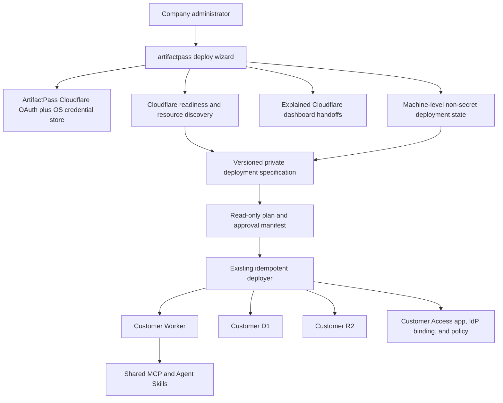
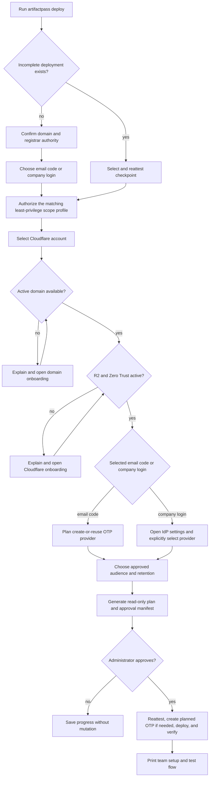
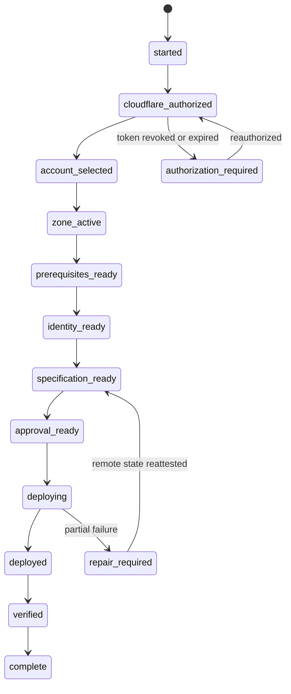
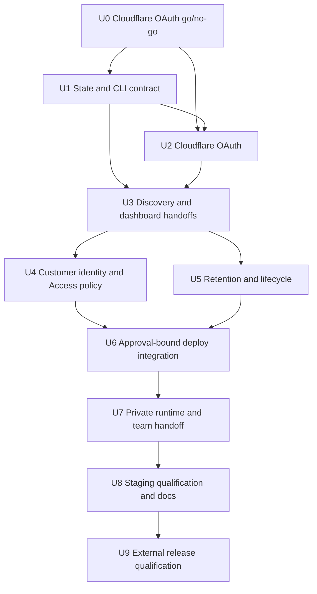

# Private Deployment Onboarding - Plan

## Goal Capsule

- **Objective:** A company administrator who controls a domain and its registrar can start with no prior Cloudflare experience, deploy a private ArtifactPass instance on that domain, configure company-controlled sign-in, prove browser and agent sharing, and resume safely after any interruption.
- **Means:** Build a resumable `artifactpass deploy` admin wizard around the existing approval-bound Cloudflare deployer, using ArtifactPass Cloudflare OAuth by default and Cloudflare dashboard handoffs for account billing, domain activation, R2 activation, Zero Trust onboarding, and company identity-provider secrets. (KTD1-KTD10)
- **Authority:** Product Requirements govern behavior. Key Technical Decisions govern implementation. Cloudflare's current API and product contracts govern external integration behavior.
- **Execution profile:** Deep, security-sensitive, external-API implementation across the setup CLI, Worker authentication, protocol policy, packaging, tests, and documentation.
- **Stop conditions:** Stop before mutation when authorization is insufficient, the selected domain is not active, R2 or Zero Trust is not enabled, the approval manifest has drifted, an existing managed resource conflicts, or live verification fails.
- **Tail ownership:** The implementation run owns code, automated tests, documentation, an isolated staging rehearsal, and the first fresh-domain qualification checklist. It does not own Cloudflare billing decisions or the customer's identity-provider administration.

---

## Product Contract

### Summary

ArtifactPass will provide one guided command for deploying a private instance into a customer's Cloudflare account. The command explains each required Cloudflare step, opens the relevant Cloudflare page when human action is required, detects completion, saves non-secret progress for later resumption, deploys the existing Worker with customer-owned D1 and R2 resources, and finishes with browser and agent tests.

The private deployment keeps the same MCP tools, Agent Skills, viewer, share-link protocol, and workspace installation flow as public ArtifactPass. The customer owns the domain, Cloudflare account, storage, Access configuration, logs, and bill.

In this plan, **private** means customer-owned infrastructure plus customer-controlled publishing and device approval. It does not mean that viewers authenticate: each generated share URL remains a short-lived bearer capability readable by anyone who has the URL until its exact expiry. The wizard, approval summary, deployment receipt, teammate handoff, and guide must state this plainly.

### Problem Frame

The repository already has an idempotent Cloudflare deployer, but it is an operator command that requires the caller to discover account IDs, zone IDs, Workers subdomains, identity rules, PDF keys, and approval-manifest commands. It assumes R2 and Zero Trust already exist. It can consume a Wrangler credential, but Wrangler's normal OAuth grant does not carry every permission needed to create Access identity configuration and all private deployment resources.

A new Cloudflare customer therefore cannot complete the current flow without understanding Cloudflare products and reconstructing undocumented setup steps. Progress is also tied to one command invocation rather than a durable machine-level deployment record. This is the gap the new admin wizard closes.

### Key Decisions

- **Private setup assumes the administrator has never used Cloudflare.** (session-settled: user-directed — chosen over requiring a preconfigured Cloudflare account: most target teams will be first-time Cloudflare users.) Governs R1-R8.
- **Authentication belongs to the deployment owner.** (session-settled: user-directed — chosen over routing private users through ArtifactPass's public Google and GitHub login: companies must control their own identity boundary.) Governs R9-R14.
- **Private sign-in starts with email verification code or the company's existing login.** (session-settled: user-directed — chosen over a hardcoded Google, Microsoft, or Okta menu: ArtifactPass must not guess which provider a company uses.) Governs R10-R13.
- **Identity-provider credentials stay in Cloudflare.** (session-settled: user-directed — chosen over collecting provider secrets in ArtifactPass: the administrator configures the provider in Cloudflare and ArtifactPass only detects and binds its identifier.) Governs R11-R13, R21.
- **Billing and plan selection stay in Cloudflare's website.** (session-settled: user-directed — chosen over billing APIs or card collection in the CLI: ArtifactPass must not own customer payment decisions.) Governs R3-R6, R21.
- **Deployment progress is machine-wide and folder-independent.** (session-settled: user-approved — chosen over workspace-local progress: an administrator must be able to leave one folder and resume from another.) Governs R15-R18.
- **Development uses the existing Cloudflare account, bill, and domain with isolated names.** (session-settled: user-directed — chosen over requiring another payment method or domain: the current account can safely host an isolated qualification deployment.) Governs R22-R24.
- **The admin CLI is the first private-deployment experience.** (session-settled: user-approved — chosen over building a non-technical admin portal first: the CLI is sufficient for the first release and the portal remains follow-up work.) Governs R1-R2, R19-R20.
- **Public and private integrations share one portable agent contract.** (session-settled: user-directed — chosen over private variants for each agent vendor: MCP and Agent Skills remain the common product surface.) Governs R19-R20, R23.
- **Private v1 uses Cloudflare Automatic storage placement.** (review-resolved — chosen over adding EU and FedRAMP placement matrices before the core private flow is proven: explicit residency controls are a later product capability.) Governs R7-R8, R22, R24.
- **Every connected device owns its PDF signing key.** (review-resolved — chosen over distributing an administrator private key: teammates must publish controlled PDFs without exporting a shared secret.) Governs R16, R20, R23.

### Actors

| ID | Actor | Responsibility |
|---|---|---|
| A1 | Company administrator | Owns the Cloudflare account, domain and registrar authority, Access policy, and deployment approval. |
| A2 | Company teammate | Installs the portable integration in a workspace, connects to the private deployment, and publishes through the shared MCP. |
| A3 | Cloudflare | Hosts account onboarding, billing, DNS activation, R2, D1, Workers, Zero Trust, identity providers, Access, and the deployed service. |
| A4 | ArtifactPass setup CLI | Guides setup, obtains scoped authorization, detects prerequisites, persists non-secret progress, builds the approval manifest, deploys, and verifies. |
| A5 | ArtifactPass Worker | Enforces company sign-in for human actions, scoped agent tokens for MCP publishing, expiring capability links for reading, and private D1/R2 access. |
| A6 | Compatible AI agent | Uses the existing ArtifactPass Skill and MCP tools without private-deployment-specific product logic. |

### Requirements

#### Guided Cloudflare onboarding

- R1. Running `pnpm dlx artifactpass deploy` without deployment flags starts a plain-language private-deployment wizard rather than printing a missing-flags error.
- R2. Before each browser handoff, the wizard explains what the Cloudflare page does, what the administrator must complete, what ArtifactPass will read afterward, and whether the step changes Cloudflare state.
- R3. Before Cloudflare authorization, the wizard records the selected sign-in mode so it can request only the account, zone, Worker, D1, R2, and Access permissions required by that mode; email-code setup may request identity-provider write, while existing-company-login setup requests provider read only.
- R4. A short-lived custom Cloudflare API token remains an explicit fallback for organizations that disable third-party OAuth or for headless automation.
- R5. When the selected account has no active domain, the wizard opens Cloudflare's domain onboarding, waits for the administrator to add the domain and update registrar nameservers, and resumes only after Cloudflare reports the zone active.
- R6. When R2 or Zero Trust is inactive, the wizard opens the corresponding Cloudflare onboarding page and waits for completion; the CLI never selects a plan, accepts terms, adds a payment method, or changes billing.
- R7. The administrator selects the Cloudflare account, active domain, and ArtifactPass hostname from values discovered from Cloudflare rather than copying account or zone IDs; v1 uses Cloudflare Automatic placement and does not claim regional residency.
- R8. Existing active accounts, domains, R2 subscriptions, Zero Trust organizations, and Workers subdomains are detected. D1, R2, Worker, Access, and lifecycle resources are reused only when their recorded Cloudflare IDs and deployment-specific remote ownership markers all match; a name-only match is a conflict.

#### Customer-owned authentication

- R9. A private deployment protects browser upload and agent-approval paths with the customer's Cloudflare Access organization while leaving health and live share links outside the login wall; the administrator must acknowledge before approval that anyone holding a share URL can read it until expiry.
- R10. The wizard offers two human-readable sign-in choices: email verification code or existing company login.
- R11. Choosing email verification code plans the creation or reuse of Cloudflare's One-time PIN identity provider, restricts the managed Access application to that provider, and requires at least one approved email domain or explicit email address; the provider is not created until after deployment approval.
- R12. Choosing existing company login opens Cloudflare's identity-provider setup, detects the configured providers, lets the administrator select by provider name, and stores only the Cloudflare provider ID in deployment state.
- R13. When exactly one provider is allowed, the Access application redirects directly to it; provider secrets, assertion certificates, client secrets, and directory credentials never enter ArtifactPass state or logs.
- R14. The administrator chooses who may publish through the selected login. Email-code deployments require approved domains or explicit addresses. Existing-company-login deployments may allow everyone authenticated by the selected company provider, approved domains, or explicit addresses. The exact Access policy is reviewable before deployment.

#### Resumption and secret handling

- R15. Every completed step is recorded in a versioned machine-level deployment record under the ArtifactPass config directory, independent of the current workspace and addressable by an immutable deployment ID even before a hostname exists.
- R16. The deployment record contains only non-secret selections, Cloudflare resource identifiers, step outcomes, digests, and timestamps. Cloudflare OAuth credentials live in the OS credential store. Each teammate device generates its own PDF signing key during connection, keeps the private key in that device's OS credential store, and registers only the public key and key ID with the deployment.
- R17. If exactly one incomplete deployment exists, `artifactpass deploy` offers to resume it. If several exist, it shows hostname and last completed step when a hostname exists; otherwise it shows account or pending-zone context, immutable deployment ID, and last completed step.
- R18. Resumption rechecks Cloudflare state before trusting a checkpoint, uses an exclusive lock and atomic writes, and gives a clear repair path for stale locks, revoked authorization, deleted resources, or changed configuration. Administrators can inspect, resume, abandon local progress, disconnect stored Cloudflare authorization, or reauthorize without deleting the deployment record.

#### Deployment, policy, and team handoff

- R19. The wizard compiles the administrator's choices into the existing dry-run and approval-manifest deployment engine; no Cloudflare mutation occurs before a human-readable summary and explicit approval.
- R20. Successful deployment prints the private URL, a copyable teammate setup command already containing that non-secret URL, the browser test URL, the agent connection procedure, and a durable deployment receipt for later doctor, resume, upgrade, and repair operations.
- R21. ArtifactPass never stores card details, changes Cloudflare plans, controls the customer's IdP account, or receives share-document contents during deployment setup.
- R22. Public ArtifactPass remains limited to 15, 30, or 60 minutes, while a private administrator can configure allowed presets up to seven days; the R2 cleanup lifecycle must not remove a live artifact before the deployment maximum.
- R23. Private and public deployments use the same `connection_status`, `connect_artifactpass`, `publish_artifact`, and `read_artifact` tools and the same portable Agent Skills. Device approval binds the agent token, deployment origin, workspace identity, and device public signing key in one server-confirmed exchange; revoking the device or token revokes its registered key.
- R24. Development and qualification use isolated resource names and a subdomain under `artifactpass.com`; the wizard must not change the current apex, public Worker, public D1, public R2, OAuth applications, or production Access resources.

### Key Flows

- F1. **First run from a new Cloudflare account**
  - **Trigger:** A1 runs `pnpm dlx artifactpass deploy`.
  - **Actors:** A1, A3, A4.
  - **Steps:** Confirm authority to add the domain and update registrar nameservers, choose the sign-in mode, authorize ArtifactPass with the corresponding least-privilege scope set, select the account, activate a domain, enable R2 and Zero Trust in Cloudflare when needed, select the hostname, then continue to identity setup.
  - **Outcome:** All Cloudflare prerequisites are active without ArtifactPass handling billing or registrar credentials.
  - **Covered by:** R1-R8, R15-R18, R21.
- F2. **Configure private sign-in**
  - **Trigger:** Cloudflare prerequisites are ready.
  - **Actors:** A1, A3, A4.
  - **Steps:** For email code, plan an OTP provider and choose approved domains or addresses. For company login, show the current provider list, open Cloudflare if setup is needed, refresh the list, require an explicit provider selection, and choose the publishing audience. Pre-approval work is read-only; the managed login test runs only after deployment creates the Access application.
  - **Outcome:** The planned Access application names an actual customer-controlled provider and an explicit allow policy without pre-approval mutation.
  - **Covered by:** R9-R14, R16, R21.
- F3. **Review and deploy**
  - **Trigger:** Prerequisites and sign-in choices are complete.
  - **Actors:** A1, A3, A4, A5.
  - **Steps:** Generate a read-only plan, show new and reused resources, write an approval manifest, require approval, reattest remote state and bundle digest, then deploy and verify.
  - **Outcome:** The private instance runs on the chosen hostname with customer-owned D1, R2, Access, and logs.
  - **Covered by:** R8-R9, R14, R19-R24.
- F4. **Resume after interruption**
  - **Trigger:** A1 runs the command after closing the terminal, changing folders, losing authorization, or leaving a Cloudflare prerequisite pending.
  - **Actors:** A1, A3, A4.
  - **Steps:** Find the machine-level record, reacquire a lock, reauthorize if needed, recheck completed steps, and continue from the first unproven step.
  - **Outcome:** No completed human setup is repeated and no stale local assertion causes an unsafe mutation.
  - **Covered by:** R15-R18.
- F5. **Connect the team**
  - **Trigger:** Deployment verification passes.
  - **Actors:** A1, A2, A5, A6.
  - **Steps:** A teammate runs the admin-provided setup command containing the private URL, starts an agent session, invokes Connect ArtifactPass, completes company sign-in, reviews the deployment, agent, workspace, and device identity, approves the device code and public signing key, and publishes a test artifact.
  - **Outcome:** The same portable integration works against the private service without provider-specific agent code.
  - **Covered by:** R19-R20, R23.

### Admin CLI Experience

The wizard should read like this. Exact punctuation may change during implementation, but the questions and sequence are the product contract.

```text
Set up a private ArtifactPass deployment

ArtifactPass will deploy a Worker, D1 database, R2 bucket, and Cloudflare Access application into your Cloudflare account.
Cloudflare handles your account, plan, payment method, domain, and company login.

Continue? [y/N]

Do you control the domain and have permission to update its registrar nameservers?
1. Yes
2. Not yet

How should people sign in?
1. Email verification code
2. Existing company login

Opening Cloudflare so you can authorize ArtifactPass.
ArtifactPass requests permission only for the account and deployment resources shown on that page.

Which Cloudflare account should own this deployment?
1. Example Company
2. Personal Account

Which domain should ArtifactPass use?
1. example.com
2. Add another domain in Cloudflare

What hostname should people use?
artifacts.example.com

Who may publish artifacts?
1. People with approved email domains
2. Specific email addresses

For an existing company login, the first option is instead:
1. Everyone who can use the selected company login

How long may private links remain active?
Select one or more: 15 minutes, 30 minutes, 1 hour, 24 hours, 7 days

Review private ArtifactPass deployment
Account: Example Company
Hostname: artifacts.example.com
Sign-in: Example Company SSO
Publishers: @example.com
Storage placement: Cloudflare Automatic (no regional-residency claim in v1)
Link limits: 15 minutes, 1 hour, 24 hours
New resources: Worker, D1 database, R2 bucket, Access application, Access policy
Reused resources: Zero Trust organization, company identity provider
Billing changes: none by ArtifactPass

Private means the company owns the deployment and controls who can publish.
Each generated share link is still a bearer link: anyone who has it can read the artifact until it expires.

Deploy this configuration? [y/N]
```

Every Cloudflare handoff uses the same interaction contract. It shows the purpose, whether Cloudflare will change state, the exact readiness condition, and the dashboard URL, then offers `Open Cloudflare`, `Check again`, `Save and exit`, and `Copy link`. The visible states are opening, waiting, still pending, ready, permission denied, browser-open failed, timeout, and resumed. Long waits exit cleanly after bounded polling and print the exact resume command plus the last verified Cloudflare state. For example: `Cloudflare requires you to enable R2 in its website. This creates the R2 subscription and shows any payment terms. ArtifactPass will not choose or change your plan.`

Global wizard controls are `Back` before approval, `Save and exit`, `Cancel current action`, `Abandon local deployment`, and `Start a separate deployment`. Ctrl+C saves the last proven checkpoint and prints the resume command. Changing an earlier answer invalidates dependent checkpoints and approval. Abandoning local progress never implies deleting Cloudflare resources.

### Acceptance Examples

- AE1. **Covers R1-R8.** Given a Cloudflare account with no active domain, R2, or Zero Trust organization, when the administrator follows the wizard, then each missing prerequisite opens in Cloudflare, the wizard explains the action, and deployment does not begin until all three are detected as ready.
- AE2. **Covers R3-R4, R16.** Given ArtifactPass OAuth is allowed, when the administrator authorizes the requested scopes, then the CLI can discover and deploy without reading Wrangler's credential; when OAuth is disabled, a valid custom token completes the same flow without changing deployment behavior.
- AE3. **Covers R5-R6, R21.** Given Cloudflare asks for a plan or payment method during domain, R2, or Zero Trust onboarding, when the administrator reaches that page, then the choice remains entirely in Cloudflare and no billing value is sent through or stored by ArtifactPass.
- AE4. **Covers R10-R14.** Given email verification code is selected for `example.com`, when deployment finishes, then `/upload` redirects through the One-time PIN provider, a permitted `@example.com` address succeeds, and an unlisted address is denied.
- AE5. **Covers R10-R14.** Given existing company login is selected and two providers exist, when the administrator chooses `Example Company SSO`, then only that provider ID is bound to the Access application, its secret remains in Cloudflare, and the login redirects directly to it.
- AE5a. **Covers R10-R14.** Given existing company login is selected and no provider exists, when the administrator opens Cloudflare, then the wizard explains that company identity-admin access may be required, remains resumable while setup is incomplete, refreshes the provider list on request, requires explicit provider selection, and can switch to email code without discarding completed Cloudflare prerequisites.
- AE6. **Covers R15-R18.** Given setup stops while nameservers are pending, when the administrator reruns the command from another folder after activation, then the wizard finds the same deployment, rechecks the zone, and continues at the next step.
- AE7. **Covers R17-R18.** Given two incomplete deployment records exist, when `artifactpass deploy` starts, then neither is guessed; the administrator sees each hostname when available, otherwise its account or pending-zone context and immutable deployment ID, plus the last completed step, and chooses one.
- AE8. **Covers R18-R19.** Given the Worker bundle, Access policy, resource identity, or retention choice changes after approval, when deployment resumes, then the manifest is invalidated and no mutation occurs until a new review and approval.
- AE9. **Covers R8, R19-R20.** Given a matching private deployment already exists, when the recorded IDs and every remote ownership marker agree and the same configuration is approved again, then resources are reused, migrations and verification run safely, and no duplicate Worker, database, bucket, Access application, or policy is created; a same-name resource without proof is rejected.
- AE10. **Covers R22.** Given a private deployment allows a seven-day artifact, when it is published, then it remains readable until its exact cutoff and the R2 lifecycle cannot delete it early; the public deployment still rejects any expiry over one hour.
- AE11. **Covers R9, R20, R23.** Given deployment completes, when a teammate runs the admin-provided setup command containing the private URL, signs in through the configured provider on first Connect, and approves the shown agent, workspace, and device identity, then the agent publishes and another agent reads the exact test artifact through the shared contract.
- AE11a. **Covers R16, R20, R23.** Given a teammate connects a new device, when approval completes, then the device private PDF key never leaves its OS credential store, the corresponding public key is registered with the agent token and workspace, a controlled PDF publishes successfully, and device revocation prevents both token use and future signatures from that key.
- AE12. **Covers R24.** Given qualification runs under an isolated `artifactpass.com` subdomain and resource prefix, when it finishes or fails, then the existing public hostname, resources, OAuth applications, and Access policies are unchanged.

### Success Criteria

- A fresh administrator can complete the flow by reading only the CLI and the Cloudflare pages it opens.
- Every interrupted step can resume from another directory without re-entering non-secret choices.
- No secret appears in the deployment record, approval manifest, process arguments, generated config, logs, test evidence, or error text.
- An idempotent second deployment reports reused resources and creates no duplicates.
- Browser upload, device approval, agent publish, cross-agent read, exact expiry, and cleanup pass against the isolated private staging deployment.
- Implementation is complete when the wizard, staging deployment, automated proof, documentation, and executable fresh-domain qualification procedure are ready.
- Release readiness is a later milestone: the first external fresh-domain qualification must complete without engineering intervention beyond defects recorded and fixed in the product.

### Scope Boundaries

#### Included now

- Interactive private-deployment wizard and explicit headless fallback.
- ArtifactPass Cloudflare OAuth client integration with API-token fallback.
- Domain, R2, and Zero Trust readiness detection plus explained dashboard handoffs.
- One-time PIN and existing Cloudflare identity-provider selection.
- Email, email-domain, and authenticated-user Access policies.
- Machine-level resumable state, OS-secret storage, approval binding, doctor, and repair behavior.
- Private retention presets up to seven days and aligned cleanup policy.
- Staging rehearsal and documented fresh-domain release qualification.
- Cloudflare Automatic placement for D1 and R2 in v1, with no regional-residency claim.

#### Deferred to Follow-Up Work

- A hosted or graphical private-deployment admin portal.
- Invitation emails, guest directories, member revocation UI, and organization membership management inside ArtifactPass.
- Provider-specific setup forms or a provider marketplace inside ArtifactPass.
- Explicit EU, FedRAMP, or other regional-placement controls before the core private flow is qualified.
- Group and claim builders beyond Cloudflare's existing Access dashboard and the initial email-based policies.
- Windows OS credential-store support; the first private admin wizard retains the repository's current macOS and Linux credential-store support, while Windows administrators use the explicit non-persisted API-token path until native storage is added.
- Automated nameserver changes at a registrar.
- Automatic Cloudflare plan selection, subscription upgrades, or payment handling.

#### Outside this product's identity

- Storing or proxying customer identity-provider secrets through ArtifactPass.
- Running private deployments in Lorde Builds' Cloudflare account on behalf of customers.
- Separate MCP tools, skills, or core behavior for individual agent vendors.
- Listing private artifacts, preserving a share history, or making expired links recoverable.

---

## Planning Contract

### Key Technical Decisions

- KTD1. **Make bare `artifactpass deploy` the interactive private admin entry point.** (session-settled: user-approved — chosen over a separate admin portal in v1: the CLI is the first supported private setup surface.) Existing explicit deployment flags remain the non-interactive compatibility path, and `deploy-public` remains a maintainer-only public release operation. Covers R1-R2, R19-R20.
- KTD2. **Use a dedicated ArtifactPass Cloudflare OAuth client with Authorization Code and PKCE.** Wrangler OAuth does not prove the complete least-privilege permission set for private Access and R2 provisioning. The wizard asks for the sign-in mode before authorization and selects one frozen scope profile: base deployment plus provider read for company login, or base deployment plus provider write for email code. The setup CLI owns its Cloudflare authorization lifecycle and stores its refresh credential in the OS credential store by default; `--no-save-authorization` and a short-lived custom token remain explicit alternatives. Covers R3-R4, R16, R21.
- KTD3. **Keep account-commercial prerequisites in Cloudflare's UI.** (session-settled: user-directed — chosen over billing APIs: ArtifactPass must not handle plans or payment methods.) The CLI opens the relevant dashboard page and polls only the readiness state required to continue. It does not create the zone or Zero Trust organization through an API in v1. Covers R5-R7, R21.
- KTD4. **Persist a versioned deployment state machine, not a command transcript.** (session-settled: user-approved — chosen over folder-local files: progress must resume anywhere on the machine.) An immutable operation ID is created before authorization and remains the security identity for the state file, lock, and stored credential. Hostname is a later display alias in an atomic index, so a nameserver wait can resume before a hostname exists. Each checkpoint records a proven state and its Cloudflare evidence. Atomic writes, stale-lock recovery, schema validation, bounded file size, and pre-resume reattestation follow the existing local migration journal pattern. Covers R15-R18.
- KTD5. **Use Cloudflare Access as the private human-auth boundary.** (session-settled: user-directed — chosen over ArtifactPass public OAuth: private authentication belongs to the customer deployment.) The managed application protects only `/upload*` and `/connect/approve*`; the Worker validates Access assertions on protected API requests, and live `/a/` capability routes remain outside Access. Covers R9-R14.
- KTD6. **Treat identity-provider setup as an approval-bound plan plus provider-neutral detection.** (session-settled: user-directed — chosen over hardcoded provider forms: the customer's Cloudflare account is the authority.) Before approval, email-code setup records `create if absent` without mutating Cloudflare. Existing company login is configured in Cloudflare, discovered by ID and name, explicitly selected by the administrator, and attached through `allowed_idps`; `auto_redirect_to_identity` is enabled only for one allowed provider. The managed login test runs after the Access application exists. Covers R10-R14, R16, R21.
- KTD7. **Extend the current deployer instead of creating a second provisioning engine.** The wizard resolves human choices into a versioned deployment specification consumed by the existing dry-run, approval-binding, rollback, migration, and readiness machinery. Idempotency is strengthened with deployment-ID ownership markers across Worker configuration, D1 metadata, an R2 sentinel, and a deployment-specific lifecycle rule; names alone never prove ownership. Covers R8, R18-R20, R24.
- KTD8. **Bind retention to approval and keep placement simple in v1.** Private expiry presets are deployment configuration, capped at seven days, while public configuration remains capped at one hour. The R2 lifecycle is derived from the private maximum plus a cleanup safety margin. D1 and R2 use Cloudflare Automatic placement in v1; regional controls are deferred and no residency guarantee is made. Covers R7-R8, R18-R19, R22.
- KTD9. **Register a distinct PDF signing key per connected device.** The agent bridge generates the key locally during connection and keeps the private Ed25519 key in that device's OS credential store. The device authorization request carries only the public key and key ID; human approval binds them transactionally to the agent token, deployment origin, and workspace in D1. The Worker verifies controlled-PDF provenance against active registered keys, and token or device revocation revokes the key. The existing static public-key binding remains a compatibility path for the current public deployment while migration completes; no administrator private key is distributed. Covers R16, R19-R21, R23.
- KTD10. **Qualification uses an isolated real deployment and a separate fresh-domain gate.** (session-settled: user-directed — chosen over requiring another account, payment method, or domain for development: isolated names are sufficient for implementation rehearsal.) The current account proves provisioning and runtime behavior. The first unrelated fresh domain proves first-time nameserver onboarding before private deployment is called release-ready. Covers R22-R24.

### High-Level Technical Design

The diagrams describe required boundaries and sequencing. They do not prescribe exact class or method names.

#### Component boundary



#### Guided onboarding sequence



#### Resumable deployment lifecycle



### Deployment State and Secret Boundary

The default state root is the existing ArtifactPass config root, using `~/.config/artifactpass` on Unix-like systems or the current platform resolver. Each operation starts at `deployments/by-id/<deployment-id>.json` with an adjacent lock. After hostname selection, an atomic `deployments/by-hostname/<normalized-hostname>.json` index points to that immutable ID; the state and credential identity are never renamed. Hostname-less records display the account or pending zone plus operation ID. The schema records:

- schema version, creating and last-writing CLI versions, deployment ID, optional hostname, service name, and current stage;
- selected Cloudflare account and zone IDs plus display names;
- R2, D1, Worker, Access application, Access policy, organization, and identity-provider IDs;
- Automatic-placement status and retention choices;
- approval-manifest path and digest, Worker bundle digest, remote-state and ownership-marker digests, timestamps, and verification outcomes;
- whether a Cloudflare dashboard prerequisite is pending and the last readiness evidence.

The state file never records an access token, refresh token, API token, identity-provider secret, PDF private key, artifact byte, share link, browser session, or agent token. OAuth refresh credentials use deployment-ID-scoped accounts under the existing `artifactpass` OS credential service. Device PDF private keys use device-scoped accounts on the teammate machine. Headless API tokens remain environment-only.

### Cloudflare Authorization Contract

The ArtifactPass Cloudflare OAuth client defines two least-privilege scope profiles selected before authorization. Both request:

- account and user read;
- zone read;
- Workers Scripts write;
- Workers Routes write;
- D1 write;
- R2 Storage write;
- Access Apps and Policies write;
- Access Organizations read;
- Access Identity Providers read.

The email-code profile additionally requests Access Identity Providers write. It does not request Access Groups write. The exact Cloudflare scope identifiers are release data, not guessed constants: U2 must qualify them against the staging OAuth client before later implementation proceeds.

The client does not request billing write, account settings write, broad zone write, DNS-record write, registrar access, or Access group write. Authorization uses a registered loopback callback with PKCE and verified state. The token is refreshed only for an active admin operation. `artifactpass deployment auth status` reports credential presence and granted scopes without revealing the token. `artifactpass deployment auth disconnect` revokes the OAuth grant when Cloudflare supports revocation and always removes the local credential; future doctor, upgrade, or repair commands reauthorize. Revocation, scope changes, account-admin OAuth restrictions, and callback timeouts return the wizard to `authorization_required` without discarding non-secret deployment progress.

### Sequencing



### Assumptions

- The first interactive private admin wizard supports macOS and Linux, matching the current OS credential-store support.
- Cloudflare continues to expose OAuth, zone, R2, D1, Workers, Access organization, identity-provider, Access application, and policy APIs with the capabilities documented in the Sources section.
- The default public ArtifactPass OAuth model is an implementation premise only after U0 proves every required scope and operation. A U0 failure returns authorization to planning; the API-token fallback does not silently replace the promised default.
- Cloudflare Automatic placement is the only v1 behavior. The product makes no region or residency guarantee until explicit placement controls are separately planned and qualified.
- The seven-day private maximum is a product cap, not an invitation to indefinite storage. Share links remain bearer credentials with no listing or recovery surface.

### System-Wide Impact

| Surface | Producer | Consumer | Change and compatibility rule |
|---|---|---|---|
| CLI command contract | `packages/setup-cli` | Administrators and automation | Bare `deploy` becomes interactive; existing explicit flags remain supported. |
| Cloudflare authorization | ArtifactPass OAuth client | Setup CLI and Cloudflare API | New PKCE credential lifecycle; API token fallback remains environment-only. |
| Deployment state | Setup CLI | Resume, doctor, upgrade, repair | New versioned non-secret machine-level schema keyed by immutable deployment ID, with atomic hostname index and checkpoints. |
| Approval manifest | Cloudflare deployer | Administrator and mutation engine | New version binds OAuth scope profile, provider IDs, Access rules, Automatic placement, retention, bundle, migrations, and remote state. |
| Access app and policy | Setup CLI | Cloudflare and Worker | Adds `allowed_idps`, direct-provider redirect, and generalized authenticated/email selectors. |
| Worker bindings | Deployer | Artifact service | Private expiry and Access issuer/audience remain explicit environment bindings. |
| Protocol expiry | `artifact-protocol` | Bridge, Worker, web UI, tests | Protocol maximum expands to seven days, but each deployment enforces its own lower maximum. Public remains one hour. |
| R2 lifecycle | Deployer | Cloudflare R2 | Lifecycle derives from deployment maximum and must exceed every live artifact cutoff. |
| PDF signing keys | Agent bridge, device authorization, D1 key registry | Agent bridge and Worker verification | One private key per device remains in that device's OS store; its public key is approval-bound and revocable. Static deployment keys remain temporary public-compatibility behavior. |
| Session status | Worker and existing public/Access verifiers | Browser upload flow | New unprotected read-only endpoint returns minimal auth state and public policy; protected `/upload` remains the private login boundary. |
| Team installation | Setup CLI and plugin | Teammates and agents | Admin-provided command preconfigures the private URL while leaving the shared plugin disconnected until first Connect; the same four-tool MCP contract remains. |
| Documentation | Repository | Administrators, teammates, operators | Separate zero-to-private admin guide, team guide, repair guide, and release qualification record. |

### Risks and Dependencies

| Risk | Impact | Mitigation |
|---|---|---|
| Cloudflare public OAuth does not permit every required scope | Wizard cannot provision one or more resources | Prove scopes against the isolated staging OAuth client before shipping; keep a least-privilege custom-token fallback and fail before mutation. |
| ArtifactPass OAuth access token is rejected by Wrangler | Migrations, lifecycle, secrets, deploy, or rollback fail despite successful authorization | Propagate only the active token as `CLOUDFLARE_API_TOKEN` in a scrubbed child environment and qualify every Wrangler operation in U2; if a live operation rejects it, replace that subprocess with the direct API or make the custom-token prerequisite explicit before mutation. |
| OAuth app publication is irreversible or broadly visible | Premature public client creates support and security exposure | Qualify a private/staging client first; publish the production client only after redirect URL, domain verification, privacy, terms, logo, and scope tests pass. |
| Nameserver activation takes hours | Wizard appears stalled or loses progress | Persist `zone_active` as pending, exit cleanly with a resume instruction, and poll with bounded intervals only while the command remains open. |
| R2 or Zero Trust onboarding requires plan acceptance | CLI could accidentally become a billing surface | Never call billing APIs or auto-create commercial prerequisites; explain and open Cloudflare, then perform read-only readiness checks. |
| Provider setup varies across companies | Hardcoded provider flow becomes wrong or leaks secrets | Use Cloudflare's provider list and dashboard; bind provider IDs only and never parse provider-specific secret forms. |
| Email-code policy is left internet-wide | Any email address can publish into a supposedly private deployment | Do not offer unrestricted OTP in v1; require approved domains or explicit addresses and bind the exact selectors to approval. |
| Seven-day expiry conflicts with the current two-day R2 lifecycle | Live artifacts can disappear early | Derive lifecycle days from maximum expiry plus a safety margin and add an integration test that inspects both policy and live behavior. |
| Local checkpoint disagrees with remote Cloudflare state | Unsafe reuse or incorrect resume | Reattest every completed external step, include remote digests in approval, and move to repair instead of guessing. |
| Partial deployment leaves mixed resources | Administrator cannot tell whether retry is safe | Reuse current rollback and idempotency patterns, persist changed resource IDs as each mutation succeeds, and provide doctor output with exact containment status. |
| Session status leaks identity or bypasses Access | Public homepage exposes company data or treats a forged cookie as signed in | Return only auth state plus public policy, reuse the existing token verifiers, keep mutations protected, and test the real Cloudflare edge separately from direct Worker assertion tests. |
| A device key outlives its agent credential | A revoked teammate can still produce apparently trusted PDFs | Register key and token transactionally, check active key state on every controlled-PDF publish, and revoke both together. |
| Testing on the current domain misses first-time registrar behavior | Release claim overstates evidence | Keep fresh-domain onboarding as an explicit RC qualification gate and do not claim it from the isolated subdomain rehearsal. |

### Sources

#### Repository grounding

- `packages/setup-cli/src/cloudflare/deployment.ts` provides approval binding, idempotent resource reuse, rollback, migrations, lifecycle configuration, and hosted readiness checks.
- `packages/setup-cli/src/local-state-migration.ts` provides the journal, atomic write, lock, stale-lock recovery, rollback, and OS-credential patterns.
- `packages/setup-cli/src/cloudflare/client.ts` provides the existing Cloudflare envelope and error boundary.
- `packages/agent-bridge/src/auth/credential-store.ts` provides macOS Keychain, Linux Secret Service, environment-only, and deployment-profile credential patterns.
- `apps/artifact-service/src/server/middleware/authorize.ts` and `apps/artifact-service/src/server/auth/access-jwt.ts` provide the private Cloudflare Access assertion boundary.
- `apps/artifact-service/src/server/index.ts` exposes the current private preflight gap and the deployment-specific protocol policy boundary.
- `packages/artifact-protocol/src/index.ts` owns the current 24-hour protocol maximum that private seven-day retention must extend.
- `docs/deployment.md`, `docs/architecture.md`, and `docs/security-model.md` define the current public/private ownership and security boundary.

#### External authority

- [Cloudflare OAuth overview](https://developers.cloudflare.com/fundamentals/oauth/)
- [Create a Cloudflare OAuth client](https://developers.cloudflare.com/fundamentals/oauth/create-an-oauth-client/)
- [Integrate a Cloudflare OAuth client](https://developers.cloudflare.com/fundamentals/oauth/integrate-with-cloudflare/)
- [Authorize a Cloudflare OAuth application](https://developers.cloudflare.com/fundamentals/oauth/authorizing-an-application/)
- [Cloudflare API token permissions](https://developers.cloudflare.com/fundamentals/api/reference/permissions/)
- [Cloudflare full domain setup and nameserver activation](https://developers.cloudflare.com/dns/zone-setups/full-setup/setup/)
- [Cloudflare R2 first-time setup](https://developers.cloudflare.com/r2/get-started/)
- [Cloudflare Zero Trust onboarding](https://developers.cloudflare.com/cloudflare-one/setup/)
- [Cloudflare One-time PIN identity provider](https://developers.cloudflare.com/cloudflare-one/integrations/identity-providers/one-time-pin/)
- [Cloudflare identity providers](https://developers.cloudflare.com/cloudflare-one/integrations/identity-providers/)
- [Cloudflare Access application API](https://developers.cloudflare.com/api/resources/zero_trust/subresources/access/subresources/applications/methods/create/)
- [Cloudflare Access policy controls](https://developers.cloudflare.com/cloudflare-one/access-controls/policies/)
- [Cloudflare Workers Custom Domains](https://developers.cloudflare.com/workers/configuration/routing/custom-domains/)

---

## Implementation Units

### U0. Qualify the Cloudflare OAuth foundation before product implementation

- **Goal:** Prove that the intended public-client authorization model is technically available before building the wizard around it.
- **Requirements:** R3-R4, R19, R21, R24.
- **Dependencies:** None.
- **Files:** new `scripts/qualify-cloudflare-oauth.mjs`, new `docs/private-deployment-oauth-qualification.md`, a redacted qualification record under `docs/releases/`; remove the script only if its checks become first-class U2 tests with identical coverage.
- **Approach:**
  1. Create a staging Cloudflare OAuth client with a registered loopback callback and enumerate the current exact scope IDs and resource selectors from Cloudflare rather than guessing labels.
  2. Exercise Authorization Code with PKCE through the intended public-client flow for both frozen profiles: company-login read and email-code write.
  3. Against isolated disposable resources, prove read/write operations for Workers, routes, D1, R2 bucket management, `wrangler r2 object put/get/delete` for the ownership sentinel, Access applications, policies, organizations read, identity providers read, and OTP identity-provider create/reuse/delete containment.
  4. Prove token refresh, revocation, account binding, zone binding, fixed-versus-dynamic loopback-port behavior, and OAuth bearer use by every Wrangler operation the existing deployer requires.
  5. Record a go/no-go outcome. If any required permission or bearer path is unavailable to a public OAuth client, stop and return the default authorization architecture to planning; the API-token fallback does not silently become the default product.
- **Test scenarios:**
  1. Both intended scope profiles grant only their frozen permissions and reject an out-of-profile Access operation.
  2. The OAuth access token authenticates D1 migration, R2 lifecycle, R2 sentinel object put/get/delete, secret write, Worker deploy, readiness, and rollback paths or identifies the exact operation requiring direct API replacement.
  3. The loopback callback contract works with the registered redirect rule on a clean machine and fails closed on state, port, or redirect mismatch.
  4. The qualification record contains client environment, scope IDs, Cloudflare account/zone aliases, operation results, and timestamps but no credential, authorization code, or disposable resource secret.
- **Verification:** A reviewed go decision with redacted live evidence exists before U1-U8 begin. A no-go decision ends implementation and returns the authorization model to planning.

### U1. Add the resumable private deployment command and state contract

- **Goal:** Turn bare `artifactpass deploy` into the guided, machine-level, resumable admin entry point required by R1-R2 and R15-R18.
- **Requirements:** R1-R2, R15-R18, R20.
- **Dependencies:** U0 go decision.
- **Files:** `packages/setup-cli/src/cli.ts`, `packages/setup-cli/src/commands/deploy.ts`, new files under `packages/setup-cli/src/private-deployment/`, `packages/setup-cli/test/private-deployment-cli.test.ts`, `packages/setup-cli/test/private-deployment-state.test.ts`.
- **Approach:**
  1. Add a strict versioned deployment-record schema, immutable operation ID, platform path resolver, bounded reader, atomic writer, per-operation lock, stale-lock recovery, atomic hostname index, and deployment listing.
  2. Model checkpoints as proven states from the lifecycle diagram rather than as answered prompt indexes.
  3. Add a prompt adapter whose questions match the Admin CLI Experience and whose reusable browser-handoff component implements the exact open, copy, check, pending, save/exit, failure, timeout, and resumed states.
  4. Preserve the current explicit deploy flags as non-interactive input. Reject partial combinations rather than silently falling into the wizard.
  5. Add resume selection, `--resume <hostname-or-id>`, `--new`, `--non-interactive`, and machine-readable status output without exposing secrets.
  6. Implement Back, Save and exit, Cancel current action, Abandon local deployment, Start a separate deployment, and Ctrl+C checkpoint behavior; changing an earlier answer invalidates every dependent checkpoint and approval.
  7. Record the creating CLI version, maintain explicit migrations for every released deployment-state schema, reject older writers against newer state, and print the exact pinned package command when a record cannot be safely migrated by the current version.
- **Patterns to follow:** `packages/setup-cli/src/local-state-migration.ts`, `packages/agent-bridge/src/config/local-config.ts`, current numbered setup prompts in `packages/setup-cli/src/interactive.ts` or equivalent host installer code.
- **Test scenarios:**
  1. A first bare run creates one 0600 ID-keyed deployment record under the global config root before hostname selection, regardless of working directory.
  2. A rerun from another folder finds the same incomplete operation before or after hostname selection and resumes from the first unproven checkpoint.
  3. Two incomplete records require an explicit selection and never auto-resume the wrong deployment.
  4. Concurrent runs for one deployment ID reject the second lock holder; an expired lock is recovered without deleting valid state, and an indexing crash leaves either the old valid hostname index or the new one.
  5. A truncated, oversized, unknown-version, symlinked, or schema-invalid record fails closed with a repair instruction.
  6. A simulated crash during atomic replacement leaves either the previous complete record or the new complete record, never partial JSON.
  7. Back, Ctrl+C, save/exit, abandon, and changed-answer paths preserve only proven checkpoints and never imply remote deletion.
  8. A deployment started with the previous supported RC resumes after nameserver activation with the candidate version through an explicit state migration.
  9. Existing fully flagged deploy invocations continue to parse and reach the old deploy command contract.
- **Verification:** The CLI can start, stop, list, and resume deployments from different folders, and state inspection proves that no secret-shaped field or value is serialized.

### U2. Add ArtifactPass Cloudflare OAuth with a least-privilege token fallback

- **Goal:** Give a new administrator a normal Cloudflare authorization flow that covers private provisioning without depending on Wrangler credentials.
- **Requirements:** R3-R4, R16, R18, R21.
- **Dependencies:** U1.
- **Files:** new `packages/setup-cli/src/cloudflare/oauth.ts`, new `packages/setup-cli/src/private-deployment/deployment-credentials.ts`, `packages/setup-cli/src/cloudflare/client.ts`, `packages/setup-cli/src/cloudflare/deployment.ts`, `packages/setup-cli/src/commands/deploy.ts`, `packages/setup-cli/test/cloudflare-oauth.test.ts`, `packages/setup-cli/test/deployment-credentials.test.ts`, `packages/setup-cli/test/deployment.test.ts`, package build metadata that supplies the public OAuth client ID.
- **Approach:**
  1. Implement Authorization Code with PKCE, verified state, a loopback callback, bounded browser wait, token refresh, and revocation handling against Cloudflare's documented OAuth endpoints.
  2. Freeze and qualify two scope profiles before later units proceed: base deployment plus provider read for company login, and base deployment plus provider write for email code. Ask the sign-in mode before authorization, request exactly one profile, and bind the granted scopes and OAuth client environment to approval and receipt.
  3. Store the bound OAuth credential in the OS credential store using the immutable deployment ID and an administrator account distinct from agent and device credentials. Add status, disconnect/revoke, reauthorize, and `--no-save-authorization` behavior without deleting non-secret deployment state.
  4. Keep `CLOUDFLARE_API_TOKEN` as an environment-only fallback. The fallback interaction explains why OAuth cannot continue, opens Cloudflare's token page, shows exact permissions and account/zone scope, reads the token from a non-echoing prompt or environment, reports a missing capability, and explains post-deploy revocation. It covers wrong-account, expired, canceled, and retry states.
  5. Remove Wrangler OAuth as the default private wizard credential. Preserve it only where the existing explicit operator path is already compatible.
  6. Resolve the active OAuth access token immediately before every Wrangler subprocess, including D1 migrations, R2 lifecycle, secret writes, Worker deployment, readiness, and rollback. Pass it only as `CLOUDFLARE_API_TOKEN` through a scrubbed child environment and redact child failures. If live qualification proves Wrangler rejects that bearer for an operation, replace that subprocess with the direct Cloudflare API or fail before mutation and require the explicit custom-token path.
  7. Prepare separate staging and production OAuth client configuration; production publication remains an operational release gate.
- **Patterns to follow:** `packages/agent-bridge/src/auth/credential-store.ts`, the existing ArtifactPass device-flow PKCE and browser callback patterns, `packages/setup-cli/src/cloudflare/client.ts`.
- **Test scenarios:**
  1. A valid PKCE authorization stores the token in the OS store and writes no token or authorization code to deployment state or logs.
  2. State mismatch, reused code, wrong redirect, callback timeout, refused consent, token endpoint redirect, or malformed token response fails without changing progress beyond `authorization_required`.
  3. An expired access token refreshes once and retries the original safe read; an invalid refresh token returns to authorization without deleting deployment selections.
  4. A Cloudflare account that disables third-party OAuth receives a clear API-token fallback path.
  5. A custom token missing Access, R2, D1, Worker, route, or zone permissions identifies the missing capability before mutation.
  6. OAuth and API-token paths produce equivalent Cloudflare client behavior and redact authorization from every thrown error.
  7. Company-login authorization never receives provider-write or groups-write permission; email-code authorization receives provider write only when Cloudflare exposes the qualified narrow scope.
  8. OAuth and fallback-token runs authenticate every Wrangler mutation and rollback from the packed candidate without inheriting unrelated environment credentials.
  9. Disconnect removes the local grant and revokes it when supported, `--no-save-authorization` leaves no credential after the operation, and doctor can reauthorize without losing deployment state.
- **Verification:** A staging OAuth client can authorize the isolated account, pass every permission and Wrangler-operation probe, survive token refresh, and leave no credential outside the OS store. Failure to qualify the OAuth profiles or bearer-to-Wrangler path blocks U3-U8 rather than being papered over.

### U3. Guide and detect Cloudflare account, domain, R2, and Zero Trust prerequisites

- **Goal:** Make first-time Cloudflare prerequisites understandable and resumable while keeping all commercial decisions in Cloudflare.
- **Requirements:** R2, R5-R8, R15-R18, R21, R24.
- **Dependencies:** U1-U2.
- **Files:** new `packages/setup-cli/src/cloudflare/discovery.ts`, new `packages/setup-cli/src/private-deployment/prerequisites.ts`, shared browser-opening utility, `packages/setup-cli/test/cloudflare-discovery.test.ts`, `packages/setup-cli/test/private-deployment-prerequisites.test.ts`.
- **Approach:**
  1. Before authorization, confirm the administrator controls the domain and can update authoritative nameservers. If not, stop safely and explain that a domain controlled by the administrator is required; do not suggest changing a company-wide domain without the proper owner.
  2. Discover accessible accounts and active or pending zones, and render names instead of raw IDs.
  3. For a missing domain, use the standard handoff contract to open the Cloudflare add-domain flow, explain DNS import and registrar nameservers, persist `zone_active` as pending, and poll Zone Read with bounded backoff.
  4. Detect R2 readiness with a non-mutating bucket-list request. On first-use subscription errors, explain and open R2 onboarding rather than retrying mutations.
  5. Detect a Zero Trust organization with a read request. On absence, explain and open onboarding for team name, plan, payment terms, and acceptance.
  6. Reuse an existing account-wide Workers subdomain unchanged. When none exists, derive a suggestion from the Cloudflare account name, explain that this is a shared `workers.dev` name for the whole account rather than the ArtifactPass custom hostname, let the administrator accept or edit it, bind the final name to approval, and create it only after approval. Unavailable names, concurrent creation, and changed remote state invalidate approval or enter repair rather than guessing.
  7. Record Cloudflare Automatic placement in the specification and state clearly that v1 does not offer or guarantee regional residency.
  8. Recheck every prerequisite on resume and distinguish `pending`, `ready`, `permission_denied`, browser-open-failed, timeout, and `conflict` outcomes.
- **Patterns to follow:** Existing Cloudflare envelope handling in `packages/setup-cli/src/cloudflare/client.ts` and bounded readiness retries in `packages/setup-cli/src/cloudflare/deployment.ts`.
- **Test scenarios:**
  1. An account with active zone, R2, and Zero Trust skips every dashboard handoff and reaches identity setup.
  2. A pending zone opens the documented domain page, saves progress, exits cleanly, and becomes ready after a later active response.
  3. R2 first-use and Zero Trust absence each open only their own Cloudflare page and never call a billing or plan mutation endpoint.
  4. Multiple accounts and zones show stable numbered names; inaccessible or foreign zones cannot be selected by forged input.
  5. Automatic placement is recorded without a residency promise; existing resources are reused only through the ownership protocol in U6, never by name alone.
  6. Existing Workers subdomains are reused without mutation; an absent one produces an approval-bound account-wide name, and unavailable-name, concurrent-creation, and retry paths remain deterministic.
  7. API 401, 403, 404, 429, timeout, and Cloudflare envelope errors map to actionable prerequisite states without hiding the original safe error category.
- **Verification:** A complete fake-Cloudflare matrix proves every first-time, already-configured, pending, denied, and conflicting branch; a real isolated account skips already-active prerequisites without prompting for billing.

### U4. Configure customer identity and Access policy without collecting IdP secrets

- **Goal:** Turn the administrator's sign-in and publisher-audience choices into one idempotent Cloudflare Access configuration.
- **Requirements:** R9-R14, R16, R18-R19, R21.
- **Dependencies:** U3.
- **Files:** new `packages/setup-cli/src/cloudflare/identity.ts`, `packages/setup-cli/src/cloudflare/deployment.ts`, `packages/setup-cli/test/cloudflare-identity.test.ts`, `packages/setup-cli/test/deployment.test.ts`, `apps/artifact-service/test/auth-routes.test.ts`.
- **Approach:**
  1. List identity providers and normalize only non-secret provider metadata needed for display and binding.
  2. For email code, perform read-only discovery and put a named `create if absent` One-time PIN operation in the deployment specification; create or reuse it only in U6 after approval and checkpoint its resource ID immediately.
  3. For company login, show the current providers, explain that identity credentials stay in Cloudflare, and use the standard handoff contract. After each refresh, require explicit selection whether zero, one, or several providers changed; offer email code as a fallback without discarding earlier prerequisite progress.
  4. Extend the managed Access application to bind `allowed_idps` and enable direct redirect only when exactly one provider is allowed.
  5. Generalize the policy specification to selected-company-provider users, email-domain, or specific-email selectors while preserving current deny-by-default behavior. OTP never permits an unrestricted internet-wide selector in v1.
  6. Store only provider IDs in deployment state. Provider display names remain transient; a display-name digest may enter the approval manifest for drift detection alongside destination paths, session duration, direct-redirect flag, and normalized policy selectors.
  7. Before approval, validate only provider discovery and Cloudflare's own provider-configuration status. Run a real managed Access login after U6 creates the application and policy.
- **Patterns to follow:** Current Access application and policy create/repair/rollback logic in `packages/setup-cli/src/cloudflare/deployment.ts`; JWT verification in `apps/artifact-service/src/server/auth/access-jwt.ts`.
- **Test scenarios:**
  1. OTP selection plans reuse or creation without mutating Cloudflare before approval; after approval it reuses an exact match or creates one and checkpoints the returned ID.
  2. Existing company-login selection stores only provider ID; secret-like fields and display metadata are discarded from deployment state.
  3. One selected provider enables direct redirect; multiple providers leave the chooser enabled.
  4. Selected-company-provider, one-domain, multiple-domain, and specific-email policies serialize deterministically and repair only the managed policy; unrestricted OTP is rejected.
  5. A provider deleted or renamed after approval invalidates the manifest before mutation.
  6. An existing application with foreign destinations, unmanaged policies, or incompatible identity bindings is treated as a conflict and is not overwritten.
  7. Valid, forged, expired, missing-email, wrong-issuer, and wrong-audience Access assertions preserve the Worker authorization boundary.
- **Verification:** The identity matrix proves provider-neutral setup, no secret persistence, exact Access destinations, deterministic policy binding, and fail-closed JWT enforcement.

### U5. Extend private retention and lifecycle policy

- **Goal:** Let private owners configure longer but bounded link lifetimes without changing the public one-hour policy or allowing R2 lifecycle deletion before expiry.
- **Requirements:** R8, R18-R19, R22, R24.
- **Dependencies:** U3.
- **Files:** `packages/artifact-protocol/src/index.ts`, `apps/artifact-service/src/server/storage/validation.ts`, `apps/artifact-service/src/server/adapters/cloudflare-bindings.ts`, `apps/artifact-service/src/web/routes/public-homepage.tsx`, `apps/artifact-service/src/web/routes/upload-page.tsx`, `apps/artifact-service/storage-lifecycle.json`, `scripts/build-setup-package.mjs`, `packages/setup-cli/src/cloudflare/deployment.ts`, protocol, Worker, browser, package, and deployment tests under their existing test directories.
- **Approach:**
  1. Raise the protocol ceiling to seven days while keeping each deployment's `MAX_EXPIRY_SECONDS` and `ALLOWED_EXPIRY_SECONDS` authoritative.
  2. Freeze public deployment values at 900, 1800, and 3600 seconds.
  3. Validate private selections as an ordered, unique subset of supported presets up to seven days, with at least one preset.
  4. Generate the R2 lifecycle configuration from the approved private maximum plus a full-day safety margin, rounded upward to Cloudflare lifecycle units.
  5. Render expiry choices from the server policy so the homepage, upload page, agent bridge, and Worker never maintain separate private preset lists.
- **Patterns to follow:** `artifactPolicyFromBindings`, `protocolLimitsFromBindings`, existing public deployment variable override, and packaged `storage-lifecycle.json` handling.
- **Test scenarios:**
  1. Public policy accepts 15, 30, and 60 minutes and rejects 24 hours or seven days.
  2. A private policy configured for 15 minutes, one hour, 24 hours, and seven days exposes exactly those choices to browser and MCP clients.
  3. Duplicate, unordered, empty, negative, unsupported, or over-seven-day presets fail before deployment.
  4. A seven-day artifact remains readable immediately before cutoff, disappears at cutoff, and has an R2 lifecycle strictly later than cutoff.
  5. Repacking the setup package carries the generated lifecycle and protocol policy without hardcoded stale values.
- **Verification:** Protocol, service, browser, package, and deployer tests prove policy parity and the no-early-deletion invariant for public and private configurations.

### U6. Integrate ownership, approval, deployment, rollback, and receipts

- **Goal:** Compile the wizard state into one approval-bound deployment that reuses the current safe mutation engine and produces a durable operator receipt.
- **Requirements:** R8, R16, R18-R21, R24.
- **Dependencies:** U4-U5.
- **Files:** `packages/setup-cli/src/cloudflare/deployment.ts`, `packages/setup-cli/src/commands/deploy.ts`, new `packages/setup-cli/src/private-deployment/deployment-specification.ts`, new deployment receipt schema under `packages/setup-cli/`, `apps/artifact-service/src/server/db/schema.ts`, a new D1 migration for deployment metadata and device signing keys, `packages/setup-cli/test/deployment.test.ts`, `packages/setup-cli/test/private-deployment-specification.test.ts`, `packages/setup-cli/test/private-deployment-receipt.test.ts`, `scripts/build-setup-package.mjs`.
- **Approach:**
  1. Introduce a versioned private deployment specification that contains every non-secret choice and resource binding required by the existing deployer.
  2. Define remote ownership proof using the immutable deployment ID: exact recorded Cloudflare resource IDs, a managed Worker binding, D1 deployment-metadata row, R2 sentinel object, and deployment-specific lifecycle rule ID. The R2 marker is `.artifactpass/deployment.json` with canonical versioned JSON containing deployment ID, bucket name, creation operation ID, and manifest digest. Read and compare before reuse; create only when absent through the U0-qualified Wrangler object path; mismatch is a conflict. Delete it only when the same operation created the bucket and the marker still matches, otherwise retain it and report repair containment. Name-only matches are conflicts, and lost-state adoption is deferred to a separate explicit import flow.
  3. Extend the approval manifest to bind OAuth client environment and granted scopes, authorization subject and account, zone, hostname, provider IDs, Access selectors, Automatic placement, retention, lifecycle rule, ownership markers, deployment bundle, migrations, and complete remote-state digest.
  4. Keep approval generation read-only. Immediately before the first mutation, repeat authorization, bundle, input, and remote-state attestation.
  5. After approval and final reattestation, create or reuse the planned account-wide Workers subdomain and OTP provider if needed, checkpoint each mutation, then refactor `deployArtifactShare` only enough to accept the richer private specification while preserving collision checks, migration application, Access rollback, and readiness behavior.
  6. Checkpoint each successful mutation's Cloudflare resource ID and ownership marker so repair can distinguish owned, reused, incomplete, and foreign resources. Repair never deletes or overwrites a resource unless fresh remote markers and approval prove ownership; unrelated R2 lifecycle rules are preserved.
  7. Render four explicit administrator outcomes: approval ready; approval invalidated with a grouped before/after diff and fresh approval; partial failure with created, rolled-back, and remaining resources; and verification failure. Valid recovery actions are Retry safely, Run doctor, Save and exit, or View repair instructions.
  8. Write a redacted deployment receipt only after hosted verification succeeds; it repeats the bearer-link disclosure and keeps failed state resumable with an exact containment report.
- **Patterns to follow:** Approval manifest version 2 and rollback in `packages/setup-cli/src/cloudflare/deployment.ts`; install receipt schemas and transactional installer outcomes; OS key accounts in `packages/agent-bridge`.
- **Test scenarios:**
  1. Dry run, approval write, approval apply, and idempotent rerun produce the same planned resource set without mutation during the first two steps.
  2. Input, OAuth scope, bundle, migration, provider, policy, retention, lifecycle, ownership-marker, or remote-resource drift invalidates approval before the first mutation.
  3. OTP discovery performs no pre-approval mutation; an approved create is checkpointed and rolls back or reports containment truthfully on failure.
  4. Failure after D1, R2, Access, or Worker creation records exact owned resource IDs and either restores the protected boundary or reports `repair_required` without claiming success.
  5. A rerun reuses resources only when IDs and every ownership marker match, refuses name-only collisions, and preserves unrelated lifecycle rules; R2 marker create/read/mismatch and safe-delete/retain paths are covered explicitly.
  6. Receipt validation rejects missing verification evidence, unknown schema versions, secrets, bearer URLs, absolute credential paths, or incomplete resource identity.
- **Verification:** The extended deployment suite proves no pre-approval mutation, ownership-safe reuse, approval drift safety, deterministic retries, rollback containment, actionable recovery states, and a truthful receipt.

### U7. Make the private runtime and team connection flow complete

- **Goal:** Ensure a valid Cloudflare Access session is recognized throughout the private browser flow and the normal agent installation works against the deployed URL.
- **Requirements:** R9, R16, R19-R20, R23.
- **Dependencies:** U6.
- **Files:** `apps/artifact-service/src/server/index.ts`, `apps/artifact-service/src/server/middleware/authorize.ts`, `apps/artifact-service/src/server/routes/connect.ts`, `apps/artifact-service/src/server/storage/pdf-provenance.ts`, `apps/artifact-service/src/server/db/schema.ts`, `apps/artifact-service/src/web/routes/public-homepage.tsx`, `apps/artifact-service/src/web/routes/upload-page.tsx`, `packages/artifact-protocol/src/index.ts`, `packages/agent-bridge/src/connection/connection-controller.ts`, `packages/agent-bridge/src/tools/publish-artifact.ts`, `packages/setup-cli/src/workspace-configuration.ts`, `packages/setup-cli/src/installer.ts`, `packages/setup-cli/src/commands/connect.ts`, `plugins/artifactpass/`, a D1 migration, service, browser, installer, MCP, and host acceptance tests under their existing locations.
- **Approach:**
  1. Add an intentionally unprotected, read-only `/session/status` endpoint outside `/upload*`. It verifies an optional public ArtifactPass session or private Cloudflare Access cookie through the existing auth boundaries and returns only `{ authenticated, deployment_mode, public_policy }`, never identity data. Upload mutations and approval remain protected.
  2. Keep homepage labels advisory and recheck `/session/status` at the Continue action. Only valid JSON may set authenticated; redirect, cross-origin, denied, non-JSON, expired, forged, wrong-issuer, or wrong-audience outcomes are unauthenticated.
  3. Ensure a signed-in private user uploads directly, while an anonymous user navigates to the protected `/upload` continuation, enters Cloudflare Access, and returns to the preserved document and expiry. Private deployments never route through ArtifactPass public Google/GitHub OAuth.
  4. Keep plugin installation unauthenticated and disconnected. The admin-provided setup command carries the non-secret private URL, so teammates do not repeat public/private classification or URL entry. The first `connect_artifactpass` action opens the private deployment and uses its Access login.
  5. Before requesting authorization, generate a device Ed25519 key locally. Carry only key ID and public key with the device request. The approval page shows deployment hostname, requesting agent, workspace identity, requested scope, and device key fingerprint. Approval registers the key and issues the agent token transactionally; failure issues neither. The private key enters only that device's OS credential store after server confirmation.
  6. Verify controlled-PDF provenance against active registered device keys. Disconnect, token revocation, or device revocation disables the key. Keep the existing static Worker key map only for compatible existing public deployments during migration.
  7. Define teammate states and recovery: installed/disconnected, browser opened, Access sign-in required, approval ready, approved, denied, expired, browser closed, connected, and connected to another origin. Agent success appears only after server-confirmed exchange.
  8. Preserve profile and workspace separation so a developer can use public ArtifactPass in one workspace and a company deployment in another.
  9. Make deployment completion print one copyable setup block containing the normal installer command and private URL, plus the bearer-link disclosure, instead of a second plugin or vendor-specific package.
- **Patterns to follow:** `requireHuman` and `verifyAccessJwt`, current public homepage preflight and preserved-upload flow, origin-bound agent credentials, portable plugin contract.
- **Test scenarios:**
  1. `/session/status` returns anonymous JSON without an Access redirect, recognizes valid public and private sessions without exposing identity, and treats missing, expired, forged, wrong-issuer, and wrong-audience assertions as unauthenticated.
  2. A signed-in user chooses a document and reaches the final shared-artifact result without a redundant review or sign-in step.
  3. An anonymous user preserves exact file and expiry through Access login, while cancellation returns to the original selection without upload.
  4. An expired private browser session changes Continue to sign-in and succeeds after reauthentication.
  5. A fresh teammate install from the admin-provided command shows the private integration as disconnected until the first Connect action; connection binds token, origin, workspace, and device public key and stores the private key only after server confirmation.
  6. Public and private profiles coexist in different workspaces without credential, publication journal, root, or deployment URL leakage.
  7. Denied, expired, closed-browser, wrong-origin, duplicate, and partial device approvals issue no usable credential or registered key and present one exact recovery action.
  8. Device revocation prevents both token use and controlled-PDF signatures from the registered key; another active device remains unaffected.
  9. Codex and Claude use the same plugin bundle and four MCP tools for private Markdown, HTML, and controlled-PDF publish/read acceptance tests.
- **Verification:** Direct Worker tests plus real Cloudflare Access browser E2E and representative host acceptance prove the complete private human and agent flow with no repeated sign-in, no vendor fork, no shared private key, and no cross-workspace credential reuse.

### U8. Add doctor, operational documentation, and staging qualification

- **Goal:** Make the private onboarding supportable, prove every implementation claim available on the existing account and domain, and prepare an executable external release procedure.
- **Requirements:** R2, R18-R24.
- **Dependencies:** U1-U7.
- **Files:** new `packages/setup-cli/src/commands/deployment-doctor.ts`, `packages/setup-cli/src/cli.ts`, `packages/setup-cli/test/deployment-doctor.test.ts`, `README.md`, `docs/deployment.md`, `docs/architecture.md`, `docs/security-model.md`, `docs/operations.md`, new `docs/private-deployment.md`, new `docs/private-deployment-qualification.md`, release records under `docs/releases/`, relevant live test scripts under `scripts/` and `tests/e2e/`.
- **Approach:**
  1. Add a read-only doctor that reattests local state, credential presence, Cloudflare authorization, prerequisites, resources, Access boundaries, Worker health, retention policy, and last verification without printing secrets or capability links.
  2. Write two short guides: zero-to-private for administrators and connect-to-private for teammates. Keep repair, upgrade, and security detail in operator documentation.
  3. Rehearse the complete wizard against isolated names and a staging hostname under the current Cloudflare account. Use real D1, R2, Worker, Access, OTP or test IdP, browser upload, device approval, and agent handoff.
  4. Prove idempotent rerun, interruption at each checkpoint, authorization revocation, manifest drift, rollback containment, expiry, scheduled deletion, and isolation from current public resources.
  5. Add a distribution-security gate: protected CI with npm trusted publishing and provenance, protected tags and reviewed release commits, exact RC version pinning, packed-tarball-to-commit verification, dependency and lifecycle-script inspection, and secret scanning before the privileged CLI receives Cloudflare authorization.
  6. Complete the production OAuth client's privacy/terms URLs, redirect URLs, visual identity, scopes, and support contact, but do not claim private deployment release-ready until U9 passes.
  7. Produce the exact external qualification procedure and evidence schema for U9, including unrelated account/domain prerequisites, the pinned RC and production OAuth client binding, failure invalidation, and the separate fallback-token record.
- **Patterns to follow:** Existing `docs/releases/` evidence, live browser and host acceptance tests, release validation scripts, and redacted operational records.
- **Test scenarios:**
  1. Doctor classifies a healthy, incomplete, authorization-required, prerequisite-pending, drifted, conflict, repair-required, and verification-failed deployment without mutation.
  2. Staging deployment completes from a clean local state, passes all human and agent flows, and an identical rerun creates no duplicate resources.
  3. Staging teardown or retained-resource review proves no mutation to the public hostname, OAuth clients, D1, R2, Worker, or Access application.
  4. Documentation commands and URLs match the packed release candidate and the actual wizard prompts.
  5. A release record distinguishes automated evidence, isolated-account live evidence, and the still-pending fresh-domain nameserver gate.
  6. The U9 qualification procedure is executable by a first-time administrator, names every required external prerequisite, pins the candidate and OAuth client, and cannot mark a fallback-token run as the default-path pass.
- **Verification:** The isolated staging deployment is fully functional, the operator can diagnose it without code knowledge, the teammate setup is reproducible, package provenance is verified before execution, and the candidate is implementation-complete while release status remains blocked on U9.

### U9. Run the unrelated-account, fresh-domain release qualification

- **Goal:** Decide release readiness using the exact public authorization and first-time Cloudflare journey that an unrelated customer will use.
- **Requirements:** R1-R24 release evidence only; U9 does not add product scope.
- **Dependencies:** U8 implementation-complete candidate, an unrelated Cloudflare account, a registrar-controlled unrelated domain, and an available first-time administrator.
- **Files:** the frozen record under `docs/private-deployment-qualification.md` and one release evidence artifact under `docs/releases/`; product code changes are forbidden during a qualifying run.
- **Approach:**
  1. Freeze the exact packed RC, its verified provenance and digest, the production OAuth client ID, public visibility, redirect contract, and service deployment identity.
  2. From a clean administrator environment, run the complete default OAuth journey against an unrelated Cloudflare account and domain: account onboarding, domain add, registrar nameservers, R2 and Zero Trust activation, email code or company login, approval, deployment, browser upload, teammate connection, controlled PDF, cross-agent read, repair, and idempotent rerun.
  3. Record the API-token fallback as a separate journey. It cannot substitute for the default OAuth result.
  4. Any engineering intervention, package change, OAuth-client change, or service change invalidates the candidate evidence. Fix the product, issue a new candidate, and rerun U9 from the beginning.
- **Test scenarios:**
  1. The exact public OAuth client and pinned RC complete the unrelated-account and fresh-domain journey without engineering intervention.
  2. Nameserver delay resumes through the immutable deployment record from another folder and, where needed, another supported CLI version through an explicit state migration.
  3. The final evidence distinguishes automatic proof, staging proof, default public-OAuth proof, and fallback-token proof without pooling them.
- **Verification:** U9 passes only when the external journey succeeds as written. Until then the implementation may be complete, but private deployment is not release-ready and no public readiness claim is allowed.

---

## Verification Contract

| Gate | Applies to | Required proof |
|---|---|---|
| Cloudflare OAuth foundation | U0 | Exact public-client scopes, loopback behavior, refresh/revocation, resource probes, and Wrangler bearer operations produce a reviewed go decision. |
| Setup CLI unit tests | U1-U6, U8 | State, prompt, OAuth, discovery, identity, approval, deploy, rollback, receipt, and doctor matrices pass. |
| Protocol and Worker tests | U4-U7 | Expiry, Access authentication, policy, storage, cleanup, and route behavior pass with public/private separation. |
| Typecheck and lint | U0-U8 | All workspace packages typecheck and the repository linter reports no warnings. |
| Packed installer and deployment bundle | U5-U8 | The packed npm candidate contains the correct Worker, client, migrations, lifecycle, OAuth configuration, plugin, Skill, and MCP assets. |
| Browser E2E | U7-U8 | Anonymous, signed-in, cancelled, expired, mobile, and private Access flows preserve the selected file and reach the correct final state. |
| Agent contract and representative hosts | U7-U8 | Generic contract tests plus Codex and Claude publish/read acceptance use the same four MCP tools and skills. |
| Secret and capability scan | U0-U8 | State, receipts, manifests, logs, errors, fixtures, and evidence contain no deployment credential, IdP secret, PDF private key, agent token, or live share URL. |
| Isolated Cloudflare rehearsal | U2-U8 | Real OAuth, domain, D1, R2, Worker, Access, identity, retention, browser, agent, expiry, cleanup, and idempotent rerun pass under isolated names. |
| Fresh-domain qualification | U9 release gate | The exact pinned RC and public production OAuth client complete a first-time unrelated account and domain journey without engineering intervention; fallback-token evidence is recorded separately. |
| Full release validation | U8 only | Run the repository's full release gate once after the implementation and live rehearsal are complete, not after every unit. |

The smallest gate should run after each unit. Repository-wide implementation validation belongs only at U8, after the end-to-end product behavior exists. U9 then qualifies that frozen candidate externally without changing product code.

---

## Definition of Done

### Global completion

- Every R-ID is implemented or explicitly returned to planning because Cloudflare invalidated an assumption.
- The CLI experience matches the Admin CLI Experience in meaning and sequence.
- No launch-blocking open question remains.
- Staging uses the existing Cloudflare account and domain only through isolated names, with evidence that current public resources were not modified.
- Billing and IdP secrets remain entirely outside ArtifactPass.
- Public expiry remains one hour maximum and private expiry remains seven days maximum.
- The same plugin, MCP tools, skills, and agent credential flow work for public and private deployments.
- Automated gates and the isolated live rehearsal pass.
- Implementation completion and release readiness are reported separately. The first external fresh-domain qualification may remain the sole release blocker after implementation, but the product does not claim fresh-domain readiness before it passes with the exact public OAuth client and pinned RC.
- Documentation covers administrator setup, domain-authority prerequisites, bearer-link meaning, teammate setup, state location, secret location, resume, doctor, repair, upgrade, rollback, Automatic placement, retention, and Cloudflare ownership.
- Abandoned experiments, duplicate provisioning paths, test-only bypasses, stale generated assets, and obsolete documentation are removed before completion.

### Per-unit completion

| Unit | Done when |
|---|---|
| U0 | The exact Cloudflare public-client permission, loopback, refresh, revocation, and Wrangler bearer contracts have a reviewed go decision; a no-go returns authorization to planning. |
| U1 | Bare deploy, global state, locks, atomic checkpoints, resume selection, and explicit compatibility mode are proven. |
| U2 | Dedicated Cloudflare OAuth and API-token fallback pass least-privilege, refresh, revocation, and secret-boundary tests. |
| U3 | New and existing Cloudflare prerequisite branches are guided, detected, resumable, and billing-neutral. |
| U4 | OTP and provider-neutral company login produce exact, approval-bound Access configuration without secret collection. |
| U5 | Public/private expiry and lifecycle policies are consistent across protocol, Worker, browser, bridge, and package. |
| U6 | The existing deployer consumes the richer specification with ownership proof, approval drift protection, truthful rollback, actionable recovery, and receipts. |
| U7 | Private browser and agent flows complete without redundant sign-in, vendor-specific integration logic, or shared PDF private keys. |
| U8 | Doctor, docs, staging rehearsal, implementation evidence, and the executable U9 qualification procedure are complete and honest. |
| U9 | The frozen candidate passes the unrelated-account, fresh-domain, production-OAuth journey without engineering intervention, or remains explicitly blocked from release. |
