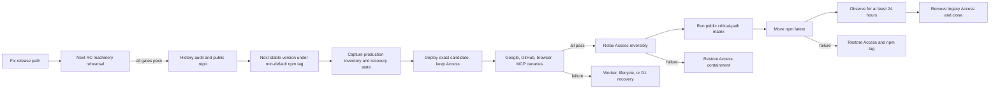

# Production Promotion - Plan

## Goal Capsule

- **Objective:** ArtifactPass is safely available at `artifactpass.com`, real users can sign in with Google or GitHub, browser and agent sharing work against the same production data, and the default npm install resolves to the exact qualified stable package.
- **Means:** Repair the release path, use an RC to rehearse the corrected release machinery, publish one stable candidate under a non-default tag, qualify those exact stable bytes in staging, deploy the same stable candidate to the existing production Worker, D1, and R2 resources behind the existing Access containment gate, prove the full product, then activate public access and npm `latest`. (KTD1-KTD7)
- **Authority:** Product Requirements govern behavior. Key Technical Decisions govern implementation. Current Cloudflare, Google, GitHub, npm, and GitHub repository contracts govern external operations.
- **Execution profile:** Deep, security-sensitive production release across OAuth, Worker deployment, D1 migration, R2 lifecycle, npm distribution, browser behavior, and MCP behavior.
- **Stop conditions:** Stop before mutation if the candidate changes, production resource identity is uncertain, more than migration `0009` is pending, recovery evidence is incomplete, provider configuration differs from the approved values, or any live gate fails.
- **Tail ownership:** The implementation run owns code, tests, staging requalification, release artifacts, production deployment, rollback preparation, and post-deploy verification. Google and GitHub application approval, Cloudflare manifest approval, npm release approval, and repository visibility remain human-only confirmation points.

---

## At a Glance

| Step | What happens | Gate before moving on |
|---|---|---|
| 1. Repair | Fix production deployment safety, GitHub PKCE, abuse limits, route authorization, ingress containment, and release docs. | Focused tests and a mutation-free Cloudflare dry-run pass. |
| 2. Rehearse | Cut the next RC and prove publish, deploy, OAuth, migration, rollback, and install machinery in staging. | The RC machinery checks pass; RC evidence is not reused as final evidence. |
| 3. Freeze | Audit every public GitHub surface, make the repository public, publish the next stable version under a non-default npm tag, and fully qualify those exact bytes in staging. | Full browser, safety, storage, OAuth, Codex, and Claude Code gates pass against the stable candidate. |
| 4. Contain | Deploy the stable candidate to the existing production Worker, D1, and R2 while Cloudflare Access still contains it. | Production identity, migration, lifecycle, recovery, OAuth, and telemetry checks pass. |
| 5. Prove | Run real Google, GitHub, browser, first-time-user, Codex, Claude Code, expiry, cleanup, and negative authorization tests in production. | Every test passes; any defect burns the stable version and returns the work to step 2. |
| 6. Release | Relax Access reversibly, rerun the public matrix, move npm `latest`, observe for at least 24 hours, remove Access, and run one final public check. | The operator records final closure, then recovery material is disposed. |

Human confirmation is needed only for the production Google and GitHub applications, the reviewed Cloudflare mutation manifest, repository visibility, npm promotion, and the unfamiliar-user acceptance test. Implementation and repeatable verification remain the execution run's responsibility.

---

## Product Contract

### Summary

Promote ArtifactPass from its working staging deployment to a controlled production release. The release reuses the existing production Worker name, D1 database, R2 bucket, hostname, and temporary Access gate. It does not create replacement production storage.

The first milestone is a production release candidate that is fully tested while the old Access boundary remains available for containment. The second milestone makes the qualified stable package the npm default and removes the legacy Access gate only after real Google, GitHub, browser, and agent flows succeed.

### Problem Frame

Staging works, but the current production route is not release-ready. The production repository is two commits ahead of the published RC17 tag, npm `latest` still points to RC2, the production deployer can create missing storage instead of failing closed, and it writes OAuth secrets with a command that creates an unintended intermediate Worker deployment. The production OAuth callbacks are not proven end to end, and the production operations guide still says seven migrations when nine exist.

The repository is also private. That prevents npm provenance on the current candidate workflow, while the public site already promises an open-source product. These facts require an explicit visibility and publication sequence rather than a single broad “deploy” action.

### Key Decisions

- **Production ships in two milestones: contained production qualification, then public activation.** (session-settled: user-approved, chosen so a provider or storage failure does not expose a broken public flow.) Governs R1, R7, R9-R13.
- **The qualified stable package is published under a non-default npm tag before production testing, then the same package version is moved to `latest`. The first intended version is `0.1.0`; a failed published version is never reused.** (planning-resolved, chosen because publishing a new version after testing would create different bytes.) Governs R1-R2, R11-R12.
- **The repository becomes public only after the history audit and immediately before the provenance-bearing stable candidate is published.** (planning-resolved, chosen because npm trusted-publishing provenance is unavailable while the repository is private.) Governs R2, R12.
- **No production D1 or R2 replacement is allowed.** (session-settled: user-directed, chosen because existing production data and resource identity must survive the release.) Governs R5-R6, R8.
- **Cloudflare deployment, OAuth administration, npm promotion, and repository visibility remain outside the ArtifactPass MCP.** (planning-resolved, chosen because these are operator actions, not artifact-sharing primitives.) Governs R10-R12.
- **No two-PC runner is part of this release.** (session-settled: user-directed, chosen because the manual two-machine proof is useful evidence but building distributed test infrastructure is outside product scope.) Governs R10, R13.

### Actors

| ID | Actor | Responsibility |
|---|---|---|
| A1 | Release operator | Reviews the candidate, recovery evidence, provider configuration, Cloudflare manifest, and activation gates. |
| A2 | Public user | Signs in, uploads an artifact, installs ArtifactPass in a workspace, and connects an agent. |
| A3 | Compatible agent | Uses the installed Skill and MCP to connect, publish, and read artifacts. |
| A4 | Cloudflare | Runs the Worker, D1, R2, custom domain, cron, logs, and temporary Access containment gate. |
| A5 | Google and GitHub | Authenticate public users through separate production OAuth applications. |
| A6 | npm and GitHub | Publish the exact package with provenance and expose the reviewed source repository. |

### Requirements

- R1. Final staging and production qualification must identify one exact git commit, Worker bundle digest, stable npm version, npm integrity, plugin digest, and migration set. RC evidence is rehearsal evidence only. A changed final value invalidates later evidence.
- R2. The stable package, initially `0.1.0`, must be published under a non-default tag with npm provenance, installed and tested by exact version, and only then promoted to `latest` without rebuilding or republishing it. If changed bytes are required after publication, that version is burned and the next unused stable version enters a fresh U2-U5 cycle.
- R3. Production uses separate Google and GitHub OAuth applications with exact `artifactpass.com` callbacks. Google starts with the operator as a test user, then moves to public production status. GitHub redirect wildcard matching is disabled.
- R4. The production homepage, privacy policy, and terms must be publicly reachable and mutually linked before Google production branding is submitted. Google and GitHub login must complete the callback, create a browser session, and return to ArtifactPass.
- R5. Production promotion must fail before mutation unless the existing Worker, D1 UUID, R2 bucket, hostname, Access application, and migration history match the approved inventory. Missing resources are not created in production mode.
- R6. Immediately before migration, enter a write-drain state, wait for in-flight writes to finish, then record the active Worker version, D1 Time Travel bookmark, D1 row counts, applied migrations, R2 object inventory, complete R2 lifecycle document, and legacy Access application with policies. Record post-bookmark test mutations by internal artifact and object identifiers so D1-to-R2 reconciliation is possible without retaining capability URLs.
- R7. OAuth secrets and reviewed Worker code must enter one Worker deployment. No command may expose a separate intermediate deployment. The legacy Access gate remains until full OAuth and device-approval canaries pass.
- R8. Only migration `0009` may be pending. It is applied to the existing D1 database. The existing R2 bucket is retained, and its managed `artifacts/` lifecycle remains longer than the seven-day maximum share duration.
- R9. Production web qualification covers the homepage, privacy, terms, responsive sign-in, Google login, GitHub login, browser upload, Markdown rendering, hostile HTML containment, human PDF handling, controlled PDF handling, download, exact expiry denial, and scheduled cleanup.
- R10. Production agent qualification installs the exact candidate in fresh Codex and Claude Code workspaces, proves `connection_status`, same-session `connect_artifactpass`, `publish_artifact`, and `read_artifact`, and proves browser upload to agent read plus agent publish to browser and second-agent read. Evidence must redact capability URLs, device codes, OAuth state, and tokens.
- R11. Public activation first relaxes the approved Access policy reversibly, reruns the public critical-path matrix from clean external clients, and only then moves npm `latest` to the already qualified stable version as the final public mutation. Any failed activation check restores Access containment; if `latest` moved, it also restores the prior tag and records that already-installed clients cannot be retracted.
- R12. Worker rollback, D1 recovery, and R2 lifecycle recovery are separate procedures. Worker rollback never claims to restore storage state. D1 Time Travel is emergency recovery after writes are contained, not the normal code rollback path.
- R13. Release claims must match the evidence. This release may claim an MCP-based integration verified on Codex and Claude Code. It may describe the implementation as using the open MCP protocol, but it must not imply live reliability on untested hosts, a statistically proven all-agent baseline, or a fully automated production eval gate.
- R14. The production manifest must enumerate every Worker ingress: custom domains, zone routes, `workers.dev`, preview URLs, and aliases. Every ingress other than `artifactpass.com` must be disabled or protected, and the contained qualification must send negative requests through each reachable ingress.
- R15. Public activation requires enforced abuse limits. The existing 25 MiB artifact ceiling remains authoritative; authentication and device initiation, authenticated publication, and capability reads gain explicit per-IP or per-identity throttles with `429` responses. Numeric thresholds, D1/R2 usage alarms, and cleanup-backlog alarms are versioned release configuration and load-tested before Access is relaxed.
- R16. Capability URLs are credentials. Viewer routes send `Referrer-Policy: no-referrer` and non-cacheable private responses, run no third-party analytics, never log artifact bodies or raw capability paths, and redact capability, device, OAuth, and token material before application or retained Cloudflare telemetry. A canary must prove no capability value appears in retained logs or outbound requests.
- R17. Access removal requires a complete route-and-actor matrix. Unauthenticated, expired, revoked, cross-user, replayed-state, CSRF, unsafe return-target, alternate-host, and direct-API requests must fail according to that matrix. The legacy Access configuration remains recoverable through the post-removal verification and final release closure, with a rehearsed emergency deny-all path that can stop public writes immediately.

### Key Flows

- F1. **Prepare and rehearse:** Repair release safety, cut the next unused RC from clean `main`, publish it under `rc`, deploy it to staging, and rehearse web, OAuth, storage, and MCP gates.
- F2. **Create the final candidate:** Audit history, make the repository public, publish the next unused stable version under a non-default tag with provenance, then qualify those exact stable package and Worker bytes in staging before creating production provider applications or capturing recovery evidence.
- F3. **Contained production qualification:** Deploy the exact stable candidate to the existing production resources while retaining Access, then complete real Google, GitHub, browser, and agent canaries.
- F4. **Activate and observe:** Relax Access through the reversible public policy, rerun the critical product matrix from clean external clients, then move npm `latest` to the qualified stable version as the final broad-distribution mutation and verify the unpinned install. Run a minimum 24-hour observation period. After its gates pass, remove legacy Access, rerun the public critical path, and only then record final release closure and dispose of recovery material.

### Acceptance Examples

- AE1. Given the approved inventory, when production preflight finds a different D1 UUID or a missing R2 bucket, then deployment stops before migration, lifecycle, secrets, or Worker changes.
- AE2. Given both OAuth secrets, when the Worker is deployed, then Cloudflare records one reviewed Worker deployment rather than a secret-only intermediate version followed by a code version.
- AE3. Given separate clean browser states, when the operator completes Google and GitHub login, then each callback creates a valid session and returns to the selected ArtifactPass flow.
- AE4. Given a fresh production workspace, when an agent first uses ArtifactPass, then it connects in the same session and can publish an artifact that the browser and another agent reconstruct exactly.
- AE5. Given a seven-day artifact and the managed R2 lifecycle, when the artifact remains live, then lifecycle cleanup cannot delete it before its cutoff.
- AE6. Given a failed activation check, when rollback runs, then the prior npm `latest` tag and Access containment are restored, the previous Worker can run against migration `0009`, and existing R2 objects remain untouched.

### Scope Boundaries

#### Included

- Production release safety fixes, separate production OAuth, migration `0009`, existing D1/R2 preservation, live web and agent qualification, npm stable publication, repository visibility, activation, observation, and rollback.

#### Deferred to Follow-Up Work

- The private-deployment launch, a two-PC runner, the 73-trial Wilson reliability baseline, automated signed production eval approval, full live coverage for every advertised MCP host, and permanent share links.

#### Excluded

- New viewer features, landing-page redesign, storage replacement, OAuth inside the ArtifactPass MCP, destructive D1 down migrations, R2 object deletion, or broad infrastructure refactoring.

### Sources

- Repository deployment and operations contracts: `docs/deployment.md`, `docs/operations.md`, `packages/setup-cli/src/cloudflare/deployment.ts`, `.github/workflows/publish-candidate.yml`, `.github/workflows/release.yml`.
- Cloudflare Worker deployment and rollback: <https://developers.cloudflare.com/workers/versions-and-deployments/> and <https://developers.cloudflare.com/workers/versions-and-deployments/rollbacks/>.
- Cloudflare secrets: <https://developers.cloudflare.com/workers/configuration/secrets/>.
- D1 migrations and Time Travel: <https://developers.cloudflare.com/d1/reference/migrations/> and <https://developers.cloudflare.com/d1/reference/time-travel/>.
- R2 lifecycle behavior: <https://developers.cloudflare.com/r2/buckets/object-lifecycles/>.
- Google OAuth production readiness: <https://developers.google.com/identity/protocols/oauth2/production-readiness/overview> and <https://developers.google.com/identity/protocols/oauth2/production-readiness/policy-compliance>.
- GitHub OAuth application and PKCE guidance: <https://docs.github.com/en/apps/oauth-apps/building-oauth-apps/creating-an-oauth-app> and <https://github.blog/changelog/2025-07-14-pkce-support-for-oauth-and-github-app-authentication/>.

---

## Planning Contract

### Key Technical Decisions

- KTD1. The next unused RC is a release-path rehearsal boundary. The next unused stable version is then created from the same reviewed product code, published under a non-default npm tag, and becomes the final identity boundary. Every staging gate is rerun against that stable npm integrity, plugin digest, commit, Worker bundle, and migration set before production. If a defect requires changed bytes after stable publication, that stable version is permanently disqualified and the process restarts at U2 with the next unused RC and stable version.
- KTD2. Production deployment gains a fail-closed existing-resource mode. It accepts the approved Worker, D1, R2, hostname, and Access identities and refuses to create replacements or apply an unexpected migration set.
- KTD3. The public cutover becomes two-phase. Deploy and verify the candidate while retaining legacy Access, then run a separate state-bound activation that relaxes Access reversibly, proves the full public matrix, promotes npm `latest`, observes for at least 24 hours, and removes the legacy application only after the observation gates close.
- KTD4. OAuth secrets are written to a mode-`0600` temporary secrets file and supplied to the reviewed Worker deployment itself. The file is removed on every terminal path. `wrangler secret bulk` is not used for public promotion.
- KTD5. GitHub OAuth adds S256 PKCE while retaining state validation. Provider tokens remain opaque and are discarded after identity lookup.
- KTD6. The release record binds preflight inventory, recovery evidence, approval manifest, active deployment ID, npm integrity, provider application IDs, test results, activation time, and observation outcome. It stores no token, secret, device code, OAuth state, full capability URL, or artifact body.
- KTD7. Rollback is component-specific: restore Access and npm tags for activation failures, roll the Worker back by version for code failures, restore the prior lifecycle document for lifecycle drift, and use D1 Time Travel only for confirmed database damage after stopping writes. Before Time Travel, reconcile the post-bookmark mutation ledger against D1 and R2 and apply the recorded disposition so metadata and objects cannot silently diverge.

### High-Level Technical Design

### Sequencing

1. U1 fixes release blockers before any new candidate exists.
2. U2 creates the next unused RC and proves only the corrected publication, deployment, rollback, OAuth, and packed-install machinery in staging.
3. U3 prepares public source, publishes the next unused provenance-bearing stable candidate, and reruns the complete staging qualification against its exact bytes.
4. U4 captures production identity and recovery state, then performs the contained deployment.
5. U5 runs live product qualification.
6. U6 performs activation, observation, and release handoff.

### System-Wide Impact

| Surface | Change | Failure boundary |
|---|---|---|
| Setup package and plugin | Next unused RC, then next unused stable version, exact host selection retained | Version or integrity drift invalidates qualification |
| Public deployer | Existing-resource lock, atomic secret/code deploy, retained-Access phase, explicit activation | Stops before mutation or restores containment |
| OAuth | Separate production Google and GitHub applications, GitHub PKCE | Full callbacks must pass, redirects alone are insufficient |
| D1 | Existing UUID, migration `0009` only | Bookmark and previous Worker retained; no down migration |
| R2 | Existing bucket and full lifecycle preserved | Prior lifecycle can be restored; deleted objects cannot |
| Website | Production pages, sign-in, upload, viewers, expiry | Browser test failure blocks activation |
| MCP and Skills | Exact package, production profile, real connect/publish/read | Failed connection or byte mismatch blocks activation |
| npm and GitHub | Public source, provenance, stable non-default tag, later `latest` | Tag promotion can be reversed without republishing; published versions cannot be reused |

### Risks and Mitigations

- **OAuth appears configured but callbacks fail.** Retain Access until both real callbacks, sessions, and device approvals pass.
- **Deployer binds replacement storage.** Require exact production resource identities and fail instead of creating.
- **Migration succeeds but Worker fails.** Prove in staging that the previous Worker can read, write, authenticate, publish, and fetch against the post-`0009` schema, then roll forward again. Retain that exact previous version for production rollback.
- **R2 lifecycle replacement removes another rule.** Capture and compare the complete lifecycle document, not only the ArtifactPass rule.
- **Public repository exposes sensitive history or CI authority.** Audit Git objects plus issues, pull requests, comments, Actions logs and artifacts, releases, wiki, LFS, environments, and repository settings. Revoke or rotate every credential finding before purging and rescanning. Restrict publication workflows with least-privilege permissions, protected environments and tags, constrained OIDC identity, SHA-pinned third-party actions, and no release secrets for untrusted pull-request code.
- **A public endpoint is abused or exhausts free quotas.** Enforce R15 before activation, alert on usage and cleanup backlog, and use R17's emergency deny-all path if thresholds are exceeded.
- **A bearer capability leaks through telemetry or navigation.** Apply R16 across Worker logs, application logs, headers, browser navigation, analytics, and canary evidence before public traffic is enabled.
- **Default install remains RC2.** Keep launch closed until `latest` equals the qualified stable version, then prove an unpinned fresh install.
- **Cron appears absent immediately after deploy.** Allow Cloudflare's propagation window and require a recorded successful invocation before closing observation.

---

## Implementation Units

### U1. Repair the production release path

**Goal:** Remove the known deployment and verification defects before another candidate is cut.

**Requirements:** R3, R5-R9, R12, R14-R17; AE1-AE2.

**Dependencies:** None.

**Files:** `packages/setup-cli/src/cloudflare/deployment.ts`, `packages/setup-cli/src/cli.ts`, `packages/setup-cli/test/deployment.test.ts`, `apps/artifact-service/src/server/routes/auth.ts`, `apps/artifact-service/test/auth-routes.test.ts`, `tests/e2e/browser-share.spec.ts`, `docs/deployment.md`, `docs/operations.md`.

**Approach:**

1. **U1a, production safety:** Add the fail-closed production inventory contract, exact pending-migration check, write-drain boundary, post-bookmark mutation ledger, single reviewed secret/code deployment, reversible Access activation, ingress inventory, emergency containment, abuse policy, route authorization matrix, and capability-safe telemetry from KTD2-KTD4 and R14-R17. Gate: focused deployer and security tests plus a mutation-free dry-run.
2. **U1b, OAuth safety:** Add GitHub S256 PKCE without changing Google behavior. Gate: focused provider-start and callback tests for valid, invalid, replayed, expired, cross-session, and unsafe-return cases.
3. **U1c, browser and operations alignment:** Update the live browser gate for the public 1-hour, 1-day, and 7-day choices, and correct the operations guide to nine migrations. Gate: the focused browser retention test and documentation consistency check.

**Patterns to follow:** Existing canonical approval manifest, secret redaction, temporary directory cleanup, deployment propagation checks, and Access restoration code in `packages/setup-cli/src/cloudflare/deployment.ts`.

**Test scenarios:**

- Covers AE1. A missing or mismatched existing production resource stops with no mutations.
- More than migration `0009` pending stops with no migrations applied.
- Covers AE2. Public deployment makes one Worker deploy with both secrets and reviewed assets.
- An interruption removes the temporary secrets file and preserves the legacy Access application.
- Activation with stale approval state refuses to relax or remove Access.
- GitHub login sends and validates S256 PKCE, while invalid state or verifier fails closed.
- The live browser test selects a public retention value actually rendered by the product.
- Oversized bodies are rejected before buffering, configured auth/device/publication/read thresholds return `429`, and load tests cannot exceed the declared D1/R2 or cleanup-backlog budget silently.
- Raw capability paths never appear in application logs, retained Cloudflare evidence, browser referrers, caches, analytics, or outbound requests.
- Every route and alternate Worker ingress satisfies its declared anonymous, authenticated, owner, operator, or internal-only policy.

**Verification:** Focused deployment, OAuth, and browser tests pass. The dry-run shows existing resource reuse, migration `0009`, one Worker deployment, and retained Access without changing Cloudflare.

### U2. Cut and rehearse the next RC in staging

**Goal:** Prove the corrected publication, deployment, rollback, OAuth, and packed-install machinery with the next unused RC before a stable version is consumed.

**Requirements:** R1, R3-R10, R13; AE3-AE5.

**Dependencies:** U1.

**Files:** `package.json`, `packages/setup-cli/package.json`, `plugins/artifactpass/plugin-metadata.json`, `plugins/artifactpass/dist/cli.mjs`, the matching RC release note under `docs/releases/`, `evals/release-policy.json`, release policy digest documentation, staging evidence outside the repository.

**Approach:** Build the next unused RC from clean `main`, publish it under `rc`, verify registry integrity, deploy that commit to staging, and run focused machinery checks: package installation, host registration, atomic secret/code deployment, both OAuth callbacks, migration `0009`, lifecycle preservation, rollback to the previous Worker, and roll-forward. Reserve the full browser, storage, safety, and one-machine agent matrix for the exact stable bytes in U3. Any fix creates another unused RC; RC evidence never substitutes for the stable evidence required by U3.

**Test scenarios:**

- Fresh exact-version installation configures each chosen host without fallback to an older cached version.
- Google and GitHub staging callbacks create valid sessions.
- A focused browser upload and agent publish smoke prove the deployment wiring without claiming final product qualification.
- Failed connection, rollback, provider callback, or safety smoke blocks the RC immediately.
- After applying migration `0009` in staging, the exact previous Worker version is rolled back and must pass critical auth, read, write, publish, and fetch flows before the candidate is rolled forward again.

**Verification:** Release checks, packed install proof, both provider callbacks, MCP negotiation, atomic deploy, migration/lifecycle preservation, focused browser-and-agent smoke, rollback, and roll-forward all pass for the same RC digests.

### U3. Prepare public source and stable candidate distribution

**Goal:** Make the reviewed source safely public, publish the exact stable candidate with provenance, and qualify that exact candidate in staging without changing product behavior.

**Requirements:** R1-R10, R13-R17; AE3-AE5.

**Dependencies:** U2.

**Files:** `.github/workflows/publish-candidate.yml`, `.github/workflows/release.yml`, `scripts/verify-distribution-security.mjs`, `scripts/scan-secrets.mjs`, version manifests, the matching stable release note under `docs/releases/`, `README.md`, repository settings and npm trusted-publisher settings outside the repository.

**Approach:** Add a history-aware secret gate and extend the existing protected candidate publisher to accept a reviewed stable version under a non-default tag; create a separate workflow only if implementation proves a distinct permission or environment-approval boundary is required. Audit Git objects and every GitHub surface exposed by a visibility change; revoke or rotate any credential finding before purging and rescanning. Harden release workflows with least privilege, protected environments and tags, constrained trusted-publishing identity, and SHA-pinned third-party actions. Bind the accepted report to the complete remote ref-name/object-ID closure, freeze protected ref mutation for the visibility window, and compare the freshly fetched closure immediately before making the repository public. Then create the next unused stable version from the rehearsed RC product code with release metadata only, publish it under a non-default tag with provenance, redeploy the exact stable commit and package to staging, and run the complete web, OAuth, storage, browser, viewer-safety, and one-machine agent matrix. Do not move `latest` yet. If any defect requires changed bytes, permanently disqualify that stable version and open a bounded defect unit before restarting at U2 with new version-bound manifests and release documentation.

While U3-U5 are externally visible but not public-release complete, the public README, npm package page, and website must call the tagged stable package a contained release candidate, state that production access is not yet generally available, and show exact-version installation only. They must not show the unpinned command while it still resolves to the old `latest`. U6 replaces this temporary messaging after public activation succeeds.

**Test scenarios:**

- A secret in any reachable commit, tag, or ref blocks the visibility gate.
- Sensitive issues, pull requests, comments, Actions logs/artifacts, releases, wiki, LFS, environments, or repository settings block visibility until resolved.
- Public identity metadata such as the accepted author name and public contact email is reported separately from credentials.
- Untrusted pull-request code cannot receive npm, Cloudflare, OAuth, or release-environment authority.
- Any remote ref added or changed between audit approval and visibility change aborts publication.
- Stable publication rejects an unreviewed tag, a tag not reachable from `main`, version disagreement, missing provenance, or unexpected package bytes.
- Exact installation of the stable candidate works while unpinned `artifactpass` still resolves to the prior `latest` value.
- Every final staging gate records the stable npm integrity, plugin digest, commit, Worker bundle, and migration set rather than inheriting RC evidence.
- Candidate-period README, npm, and website instructions clearly identify the contained state and never direct users to the stale unpinned package.

**Verification:** The repository is public only after the full-history report is accepted. npm shows the stable candidate under the non-default tag with trusted-publishing provenance and the recorded integrity. The complete staging matrix passes against that exact candidate, and `latest` is unchanged.

### U4. Deploy the stable candidate under production containment

**Goal:** Put the exact stable candidate on the existing production infrastructure without exposing an unverified public authentication path.

**Requirements:** R1, R3-R8, R12, R14-R17; AE1-AE3.

**Dependencies:** U3.

**Files:** Production provider applications, Cloudflare resources, approval manifest, and redacted release evidence outside the repository; `docs/operations.md` only if rehearsal reveals a missing operator instruction.

**Approach:**

1. Create separate production Google and GitHub applications with exact callbacks. Keep Google limited to the operator during contained qualification and disable GitHub callback wildcards.
2. Enter maintenance write-drain, wait two maximum request durations with no in-flight mutation, then capture KTD6's production inventory, D1 bookmark, and KTD7's recovery material. Declare an RPO of zero for pre-deploy writes; any observed write after the bookmark is recorded in the redacted mutation ledger.
3. Capture the complete Worker ingress inventory and route-and-actor matrix. Prove every alternate ingress is disabled or protected, and rehearse the emergency deny-all and exact Access-restoration paths while timing recovery.
4. Run dry-run and review the state-bound manifest, proving exact existing resources and only migration `0009` pending.
5. Deploy the stable candidate, migration, lifecycle, and OAuth secrets while retaining legacy Access, then exit maintenance mode only after deployment reconciliation passes.
6. Confirm public homepage, privacy, terms, health, provider starts, active Worker version, migration state, lifecycle state, abuse policy, safe telemetry, ingress state, and D1-to-R2 reconciliation.

**Test scenarios:**

- Covers AE1. Inventory drift stops before mutation.
- A secret hash, Worker bundle, migration, lifecycle, or Cloudflare state change invalidates the approval manifest.
- Covers AE2. The active deployment contains the reviewed code and both OAuth secrets with no intermediate version.
- The prior Worker version, Access application, D1 bookmark, and lifecycle document remain available after deployment.
- Each alternate ingress is unreachable or contained, and emergency deny-all plus Access restoration complete within the recorded recovery objective.

**Verification:** The exact stable deployment is active, static pages and health are public, protected paths remain contained by Access, only migration `0009` was added, D1/R2 identities and counts reconcile, and no unexpected Worker errors appear.

### U5. Qualify the real production product

**Goal:** Prove the website and installed MCP work against production before public activation.

**Requirements:** R3-R10, R13-R17; AE3-AE5.

**Dependencies:** U4.

**Files:** Redacted production evidence outside the repository. U5 is qualification-only and does not absorb product or test implementation.

**Approach:** Use separate clean browser states and fresh clean workspaces. Test Google and GitHub independently, then test browser-to-agent and agent-to-browser handoffs with the exact stable package. Stop on the first product or safety failure, invalidate the candidate, and exit U5. Open a separate bounded defect unit naming the broken behavior, owned files, and smallest validation gate. After that unit is complete, restart at U2 with the next unused RC and stable version rather than patching production evidence.

**Test scenarios:**

- Covers AE3. Google and GitHub each complete callback, session creation, upload, logout/expiry, and return behavior.
- Covers AE4. Codex and Claude Code each connect in the same session without reinstalling or restarting, then expose all four MCP tools.
- Agent publish is readable in the browser and by the second agent with matching bytes, checksum, expiry, and trust classification.
- Browser upload is readable by an agent with matching source and trust classification.
- Markdown, a larger chunked artifact, hostile HTML, human PDF, and controlled PDF follow their established viewer and agent rules.
- Covers AE5. A short-lived disposable artifact denies access at the exact cutoff and is later removed by scheduled cleanup.
- Revoked or expired browser and agent sessions return to sign-in without leaking credentials or capability URLs into retained evidence.
- Every route-and-actor negative case fails correctly, alternate ingress requests remain blocked, abuse thresholds return `429`, and a unique capability canary is absent from logs, referrers, caches, analytics, and outbound requests.
- One unfamiliar first-time user follows only the public instructions and completes sign-in, exact-version installation, first-use connection, and one successful share without operator repair. Observed confusion becomes a bounded launch blocker or explicitly documented follow-up; operator familiarity is not accepted as this evidence.

**Verification:** Every live scenario passes for the same production deployment ID and npm integrity. Google is moved to production availability and a non-test account completes sign-in before activation approval.

### U6. Activate, observe, and close the release

**Goal:** Make the qualified product the public default, retain a fast recovery path, and publish only supported claims.

**Requirements:** R2, R4, R9-R17; AE6.

**Dependencies:** U5.

**Files:** npm dist-tags, Cloudflare Access configuration, GitHub release, `README.md`, `docs/agent-setup.md`, `docs/operations.md`, the matching stable release note under `docs/releases/`, and redacted release evidence.

**Approach:**

1. **U6a, reversible activation:** Relax the approved legacy Access application through the rehearsed reversible public policy while retaining its configuration. From clean external clients and an unaffiliated network, rerun both OAuth callbacks, browser upload, viewer containment, download, agent publish/read, expiry, route negatives, and alternate-ingress checks using the stable package by exact version. Only after that public matrix passes, move npm `latest` to the qualified stable version as the final public mutation and prove an unpinned homepage installation. If any immediate check fails, restore Access and the prior dist-tag; record that already-installed copies cannot be retracted and either keep their compatible production service available or place the service in the declared maintenance state.
2. **U6b, observation and closure:** Start a minimum 24-hour observation period when `latest` promotion is confirmed. During it, record at least one propagated cron invocation, one disposable expiry and cleanup cycle, provider callback health, abuse and quota signals, cleanup backlog, Worker exceptions, D1 failures, and R2 failures. When every required event has passed and no release-attributable error remains unresolved, remove the legacy Access application while retaining its encrypted recovery material. Rerun the public critical path once more. The release operator records final release closure only after that post-removal check passes; recovery material is disposed and its deletion verified only after final closure.

**Test scenarios:**

- Before npm promotion, the exact stable package passes the full public matrix after reversible Access relaxation.
- Unpinned `pnpm dlx artifactpass` installs exactly the qualified stable version, targets `artifactpass.com`, and connects on first use.
- Anonymous `/upload` reaches ArtifactPass sign-in rather than Cloudflare Access after activation.
- Google and GitHub still complete after Access relaxation and after final Access removal.
- Covers AE6. A failed activation check restores the prior npm tag and Access gate without changing D1 or R2.
- A successful cron run and cleanup cycle occur without uncaught Worker, D1, or R2 errors.
- The emergency deny-all action stops public writes within the recorded recovery objective, and restoring the retained Access policy re-establishes containment.
- Usage and cleanup-backlog alarms remain below their approved thresholds throughout the observation window.

**Verification:** `latest` resolves to the qualified integrity, public browser and MCP smoke tests pass, the minimum 24-hour observation gates pass, Access removal and the post-removal critical path are confirmed, the operator records final closure before recovery material is released, and release notes make no all-agent reliability claim.

---

## Verification Contract

### Code and package gates

- `pnpm release:check`
- `pnpm test:packed-install`
- `pnpm release:build`
- Focused setup CLI deployment and OAuth tests introduced by U1.
- History-aware secret scan over all reachable commits, tags, and refs before public visibility.
- Registry verification of version, dist-tags, integrity, provenance, and packed contents.

### Staging gates

- Exact next-RC staging Worker deployment and matching exact package installation for the release-path rehearsal.
- Complete final staging qualification repeated against the exact stable npm integrity, plugin digest, commit, Worker bundle, and migration set later used in production.
- Real Google and GitHub callbacks, browser upload, viewer safety matrix, device approval, Codex and Claude connection, publish/read handoff, expiry denial, and scheduled cleanup.

### Production gates

- Exact production inventory and recovery capture before mutation.
- Dry-run and state-bound approval manifest with only migration `0009` pending.
- Staging rollback drill proving the previous Worker against the post-`0009` schema.
- Real Google and GitHub callback/session tests in separate clean browser states.
- Browser and MCP parity tests for Markdown, hostile HTML, human PDF, controlled PDF, exact download, expiry, and cleanup.
- Complete route-and-actor authorization negatives, alternate-ingress negatives, throttling/load behavior, emergency containment, and capability-log canary checks.
- Post-Access-relaxation critical-path matrix from clean clients and an unaffiliated network before npm `latest` moves.
- Active Worker deployment ID, no pending D1 migrations, preserved R2 lifecycle, successful cron invocation, and no new uncaught production errors.

### Statistical and claim boundary

The manual live matrix proves the named MCP-based flows work on the tested Codex and Claude Code environments. Use of the open MCP protocol is an implementation fact, not evidence that untested hosts are reliable. The matrix does not satisfy the deferred 73-clean-trials-per-direction reliability baseline and must not be presented as broad all-agent reliability evidence.

---

## Definition of Done

- U1-U6 verification outcomes are satisfied without skipped launch-blocking gates.
- The production Worker serves the approved build at `artifactpass.com` using the existing D1 and R2 resources.
- Google and GitHub production OAuth both complete real sign-in and device approval.
- Browser and installed-agent flows share and reconstruct exact artifacts with the existing safety rules.
- An unfamiliar first-time user completes the public sign-in, install, connect, and first-share journey from the published instructions without operator repair.
- Migration `0009`, R2 lifecycle, cron cleanup, and rollback materials are verified.
- npm `latest` resolves to the exact provenance-bearing stable package that passed final staging and production qualification.
- The repository is public only after the complete history scan and accepted identity-metadata review.
- Release documentation describes only proven host and reliability claims.
- Any failed candidate evidence is invalidated rather than mixed into the final release record; an already-published defective stable version is permanently burned and never reused.
- The post-activation observation period runs for at least 24 hours; final release closure occurs only after its cron, expiry, cleanup, provider, smoke, and error gates pass, legacy Access is removed, and the post-removal critical path succeeds.
- Temporary secrets, capabilities, browser state, device approvals, test tokens, and disposable artifacts are revoked or removed from retained state.
- Recovery evidence is minimized, encrypted, access-controlled, kept outside the repository, and verifiably disposed after the operator closes the observation window.
- Abandoned implementation attempts and generated test debris are removed before the final commit.
