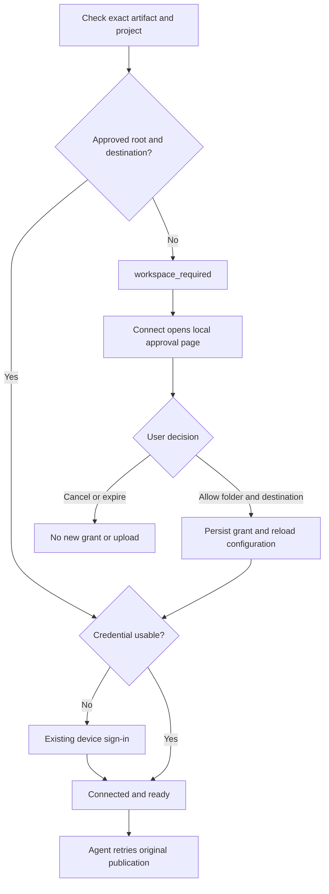
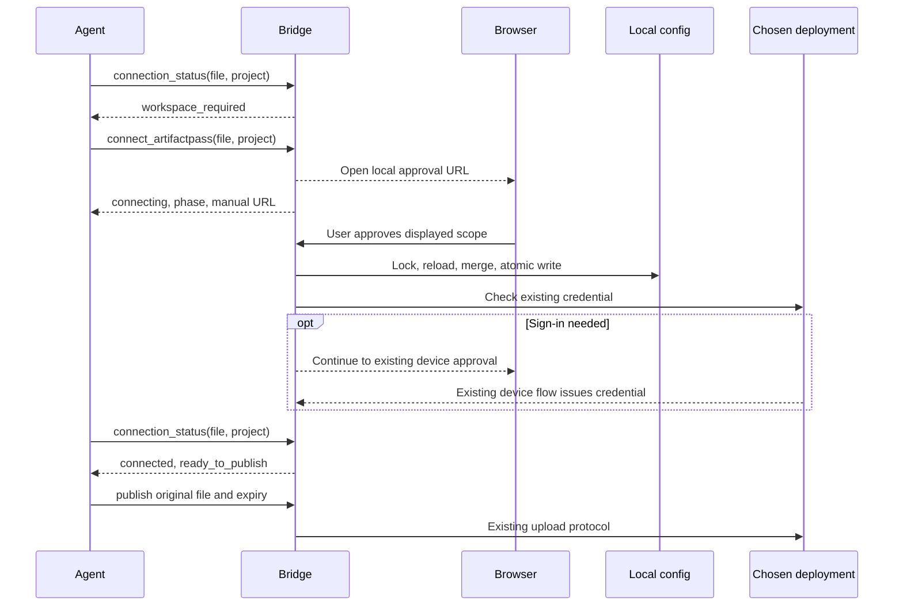

# Install Once and Approve Projects in the Agent - Plan

## Goal Capsule

- Objective: A person can ask their agent to share a document, complete any required project approval and sign-in, and receive the link without reinstalling ArtifactPass or repeating the request.
- Means: Keep the installed integration reusable, make workspace access explicit in MCP results, and add a local browser approval flow.
- Authority: This plan proposes implementation of the conversation's global-installation and per-project-approval direction. The current request authorizes planning only. Implementation, merge, and publication are separate actions.
- Execution: Work through U1–U7 in dependency order. Use focused behavioral checks during implementation and the repository's RC qualification gates before release.
- Completion owner: The implementing agent owns the client changes, documentation, release evidence, and handoff. Release authority follows the user's instructions and `AGENTS.md`.
- Stop conditions: Do not grant additional filesystem access to make a test pass. Escalate if a host cannot present approval or the proposed local flow cannot preserve the explicit consent boundary.

---

## Product Contract

### Summary

ArtifactPass remains available after one installation in hosts with user-level plugins. The first share from an unapproved project opens a page identifying the folder and publishing destination. After approval and any required sign-in, the agent resumes the same publication.

### Problem Frame

The bridge currently treats a valid deployment credential as sufficient to report `connected`. A separate file check can then reject the document because its path is outside approved roots. The connection tool does not expose that mismatch, and the sharing skill tells the agent to stop on path errors.

The earlier diagnosis reproduced this contradiction on the current 0.1.10 code. The feedback alone does not establish which folder the affected user installed from, where Codex saved their document, or which plugin version they ran. This plan addresses the confirmed contract gap and those distinct triggering conditions.

### Requirements

**Installation and compatibility**

- R1. Codex and Claude users install the integration once at user scope and can authorize another project from their agent without another install.
- R2. Every supported MCP host uses the same workspace approval and publication behavior. Existing project-specific host registration remains supported where the adapter currently requires it.
- R3. Existing approved roots, deployment selections, credentials, and headless configurations continue to work. Updating the plugin must not expand access or redirect a project's deployment.

**Access and connection**

- R4. Connection results distinguish deployment authentication, workspace access, and readiness to publish. A path outside approved roots must never receive an overall `connected` result.
- R5. A new workspace requires an explicit user decision showing its canonical folder and exact deployment origin before persistent access is granted.
- R6. An unbound workspace must not silently inherit the active private profile. Public ArtifactPass is the visible initial proposal unless an explicit environment setting selects another destination. For ordinary local configuration, the approval page permits choosing a saved deployment or entering a private origin. Environment-managed destinations remain read-only.
- R7. Approved access is limited to the selected folder and its descendants. The bridge rejects filesystem roots and the whole home directory and continues to reject symlink escapes and sensitive paths.
- R8. If the requested file is outside the current project, the agent identifies that fact and requests approval for an explicitly named containing folder. It must not copy the file into an approved directory or broaden the root automatically.
- R9. A current valid credential for the approved destination is reused. When sign-in is needed, the existing device authorization flow runs after local approval.
- R10. After approval, the running MCP process reloads the configuration and the agent retries the original file with the same expiry and canonical-source inputs. No restart is needed for project approval or sign-in.

**Failure and recovery**

- R11. Decline, expiry, browser launch failure, interrupted processes, and configuration write failures produce clear states and a concrete next action. An approval that fails before its commit cannot grant access. Authentication failure after an explicit committed approval preserves that grant but cannot upload bytes or report publication readiness.
- R12. Every approval attempt provides a usable manual URL, even if browser launch succeeds. This supports choosing another browser profile or recovering a closed tab.
- R13. Two sessions approving different folders cannot overwrite one another's grants. Changes by the CLI and the MCP use the same mutation discipline.
- R14. A user can inspect and remove a workspace grant without disconnecting every project using that deployment. Already-running bridges re-read access before subsequent publication calls; removing a grant is not a promise to cancel an upload that has already begun or revoke previously published links.

### Intended User Flow

An already installed user asks: “Share this report for seven days.” The agent checks the exact file plus its current project directory.

For an approved project with a valid login, publication proceeds immediately. For a new project, the agent says: “ArtifactPass needs access to this project. Review the folder and destination in the approval page.” The page shows:

```text
Allow ArtifactPass to publish files from this project?

Folder: /Users/alex/Projects/client-report
Publish to: https://artifactpass.com

This allows publishing supported files in this folder and its subfolders.

Allow project     Cancel
```

Deployment selection is editable before approval unless fixed by the environment. Validate a newly entered origin through existing deployment URL and transport restrictions before making requests, and never reuse a credential belonging to a different origin. If authentication is missing, the page offers “Continue to sign in” using the existing deployment approval URL. If authentication is already valid, the page confirms completion and the agent publishes.

If the document is in a separate output directory, the message names that directory before requesting its approval. The page displays it as a folder grant, without falsely calling it the current project. A missing document remains a file-not-found error; it cannot trigger arbitrary directory approval.

### Acceptance Examples

- AE1. A Codex plugin installed earlier can share from a new project after one folder approval, without CLI installation or repeating the original request. Covers R1, R5, R9, R10.
- AE2. A new project on a machine whose active profile is a company deployment receives an explicit destination choice rather than silent company routing. Covers R6.
- AE3. A user approves a project, but the document lives in a sibling directory. The first grant does not authorize that document; the agent explains the mismatch and requests a separate scoped approval. Covers R7, R8.
- AE4. A user cancels the approval page. The configuration and upload count remain unchanged, and the agent reports cancellation. Covers R11.
- AE5. Two MCP processes approve different projects while the CLI reconfigures a third. Each completed change survives without replacing unrelated configuration. Covers R13.
- AE6. A known project publishes through an older compatible private Worker after only the local plugin is updated. Covers R3.

### Scope Boundaries

This work covers local installation semantics, workspace approval, MCP contracts, skill recovery, and setup documentation. Public and private publishing use the same client path.

The proposed design adds no cloud permission endpoints, D1 schema, R2 behavior, preview changes, expiry changes, or analytics. It does not convert every project-specific host adapter into a global installer. That needs a separate compatibility assessment for each host; the current plan must not advertise those adapters as globally registered.

Full-disk approval, background filesystem scanning, automatic file copying, and a persistent localhost daemon are excluded. A dedicated one-file grant is also excluded from this pass; the page must make the scope of a containing-folder grant clear.

---

## Planning Contract

### Evidence and Existing Code

Baseline reviewed: `main` at `1d72937`, package version 0.1.10.

| Existing behavior | Owning code | Implication |
|---|---|---|
| CLI selects the supplied root or current directory | `packages/setup-cli/src/cli.ts`, `resolveCliWorkspaceConfiguration` | Terminal working directory is currently the implicit scope decision |
| Setup persists approved roots and workspace/profile mapping | `packages/setup-cli/src/workspace-configuration.ts` | Reuse the existing binding concept |
| Unmatched workspace falls back to active profile | `packages/agent-bridge/src/config/local-config.ts`, `selectLocalBridgeProfile` | Split explicit workspace lookup from legacy fallback lookup |
| Connection checks authenticate without validating the file root | `packages/agent-bridge/src/server.ts`, `connection/connection-controller.ts` | Overall readiness needs orchestration above credential status |
| Publication canonicalizes paths and enforces roots | `packages/agent-bridge/src/tools/publish-artifact.ts` | Preserve final enforcement and share the path rules with preflight |
| Missing configuration uses plugin process working directory | `packages/agent-bridge/src/server.ts`, `createBridgeConfigurationSource` | Plugin cache must never become an implicit approved project |
| Writes rename a temporary file without a shared read/modify lock | `packages/agent-bridge/src/config/local-config.ts`, `writeLocalBridgeSettings` | Atomic replacement alone does not prevent lost updates |
| Codex and Claude use plugins; other named hosts use project config | `packages/setup-cli/src/hosts/index.ts`, `hosts/project-hosts.ts` | Separate portable authorization from registration scope |
| Install smoke checks tool discovery and an invalid read | `packages/setup-cli/src/mcp-smoke.ts` | Current smoke does not prove first publication from a new project |
| Sharing instructions stop at path errors | `plugins/artifactpass/skills/share-artifact/SKILL.md` | Recovery must be represented in the tools and the skill |

The earlier workspace fixes in PRs [10](https://github.com/lordelogos/lordebuilds.artifact.pass/pull/10) and [17](https://github.com/lordelogos/lordebuilds.artifact.pass/pull/17) routed already configured workspaces correctly. They did not add approval for unconfigured workspaces.

### Assumptions

The local browser page is a proposed implementation choice, rather than an already approved visual design. It fits the existing desktop and local CLI use case. Remote MCP servers require the browser on the machine running the server, a user-managed loopback tunnel, or the explicit CLI configuration path on that machine. A remote server's loopback URL must never be presented as universally reachable from the user's laptop.

The bridge should not rely on a particular host exposing trusted workspace metadata. The agent can supply the intended root as a proposal; the user-visible approval binds the actual grant. Optional host roots may improve the proposal but are not a prerequisite for this implementation.

### Key Technical Decisions

- KTD1. Keep filesystem approval on the user's machine. Add an ephemeral loopback approval page in the bridge and reuse existing cloud device authentication. This avoids making new-project access depend on upgrading a private Worker. Applies R2, R3, R5, R9.
- KTD2. Keep the existing four MCP tool names. Extend their schemas with optional project context and structured access states. `connect_artifactpass` orchestrates approval and authentication; `connection_status` remains read-only. Applies R4, R10, R11.
- KTD3. Separate the artifact path from the proposed workspace root. Preserve `workspace_path` for compatibility as an absolute file-or-directory lookup input; add optional `workspace_root` where the agent can identify the project. Existing bindings take precedence. Unknown directories can be proposed directly; an unknown file without a project root proposes only its immediate containing folder, clearly labeled. Applies R5, R7, R8.
- KTD4. Introduce strict workspace resolution for MCP operations. Do not change every legacy call to `selectLocalBridgeProfile` indiscriminately. An existing approved root may supply a unique profile for a legacy configuration without a binding; multiple matches require a destination choice. An explicit environment deployment and roots remain authoritative. Applies R3, R6.
- KTD5. Canonicalize roots for selection, approval, persistence, and publication using the same containment helper. Resolve existing legacy paths when comparing without rewriting unrelated settings. Verify that the approved directory identity has not changed when approval is committed. Applies R7, R8.
- KTD6. Add a shared locked configuration update helper that reloads the latest settings inside the lock and atomically writes only the intended mutation. Use unique temporary filenames. Migrate CLI, connection, profile, and migration writers that can overlap; rollback must not restore a stale whole-file snapshot over a newer grant. Applies R3, R13, R14.
- KTD7. Preserve v2 configuration if the existing roots and bindings can represent the accepted grants. No new stored format is required for pending approval, which lives only for the running attempt. Validate the existing 16 KiB configuration limit before reporting success; never create a file the next launch cannot parse. Applies R3, R11, R13.
- KTD8. Local approval is a user interaction, not an MCP boolean such as `approved: true`. Bind a one-time request to canonical root, destination, config location, and attempt. A forged or repeated POST cannot change that scope. The sharing skill must not instruct the agent to click Allow or submit the approval endpoint on the user's behalf. This is not a protection against malicious code already running as the same OS user. Applies R5, R7, R11.

The [MCP roots specification](https://github.com/modelcontextprotocol/modelcontextprotocol/blob/main/docs/specification/2026-07-28/client/roots.mdx) provides client root context and consent guidance. This plan uses roots only as optional context. The loopback binding and listener lifetime follow the native-app principles in [RFC 8252, sections 7.3 and 8.3](https://www.rfc-editor.org/rfc/rfc8252.html); the proposed folder approval is not an OAuth redirect protocol.

### MCP Contract

The overall `status` retains `disconnected`, `connecting`, `connected`, and `failed` and adds `workspace_required`. Add separate `authentication_status`, `workspace_status`, and `ready_to_publish` fields. For a workspace with no selected destination, authentication is `unknown`, not an invented result for the active profile.

`connected` requires an approved path and usable credentials, or explicitly configured development mode. It does not promise that content validation or the network upload will succeed. `connecting` includes a phase identifying `workspace_approval` or `authentication`. Cancellation and expiration return `failed` with stable codes and a next action; a read-only status poll must not reopen the browser.

An unbound result exposes a proposed origin separately from a selected origin. Do not fabricate a selected `profile` merely to satisfy the old output schema; use a discriminated union with unchanged fields on established-profile states. Treat the new enum member and union as a coordinated tool-contract change, regenerate the bundled plugin, and test older call shapes explicitly.

`publish_artifact` returns a structured `workspace_not_approved` error with the attempted path and recovery action before any upload. Optional project context helps proposal selection but never authorizes access. PDF canonical-source paths require the same checks; if a source needs a second grant, report that path explicitly and revalidate both paths before publication.

### Approval Lifecycle



The approval controller is keyed by request scope, separately from the existing per-profile credential controller. Different folders sharing a profile must not share an approval state. Repeated calls for the same pending scope reuse its page. Different processes may create separate requests, but successful persistence is idempotent and conflict-aware. If another process changes the same folder's destination after the page was displayed, do not overwrite that decision: refresh the displayed destination and require a new confirmation. Unrelated folder changes can merge without another prompt.



### Approval Page and Failure Behavior

Bind only `127.0.0.1` on an ephemeral port. Use exact Host and Origin checks, a request-specific POST token, escaped path text, no CORS, no third-party resources, `no-store`, a restrictive CSP, and frame protection. GET requests display information but cannot grant access. Never put file contents, credentials, or authentication tokens into the local page or logs.

The pending request expires after ten minutes. Close its listener on cancellation, expiry, shutdown, or once the handoff to authentication is complete. Retain only bounded attempt state for status reporting. An interrupted request creates no grant; an already committed grant survives interruption and does not require approval again.

If authentication fails after a grant was saved, report “Project approved; sign-in still required.” Do not roll back unrelated grants or pretend publication is ready. If the browser cannot open, return the same manual URL. Browser profile selection must remain under user control.

Keep the page focused on the folder, destination, and Allow/Cancel actions. While saving, show “Saving project access…” and prevent duplicate submissions. A write failure stays on the page with a retry action; success says “Project approved. Return to your agent.” or offers the sign-in continuation. Announce state changes to assistive technology and preserve keyboard focus. Use existing ArtifactPass styling without promotional sections or decorative icons.

If root selection changes, the user must see the new root before final confirmation. Reject home/filesystem roots, missing directories, and targets outside explicitly configured headless roots. Headless mode does not spawn a browser or silently change environment-managed authorization.

### Affected Areas

| Area | Expected changes |
|---|---|
| `packages/agent-bridge/src/config/` | Strict workspace lookup, canonical containment, transactional local grant updates |
| `packages/agent-bridge/src/connection/` | New workspace approval controller and local page/server; existing credential flow orchestration |
| `packages/agent-bridge/src/server.ts` and `tool-contract.ts` | Explicit readiness states, root context, structured recovery errors, runtime reload |
| `packages/agent-bridge/src/tools/publish-artifact.ts` | Shared preflight and actionable workspace errors while retaining enforcement |
| `packages/setup-cli/src/` | Reusable installation semantics, shared mutation helper, workspace inspection/removal, receipt and doctor clarity |
| `plugins/artifactpass/skills/share-artifact/SKILL.md` | New-project recovery, manual URL visibility, automatic continuation, cancellation handling |
| `plugins/artifactpass/dist/` and plugin metadata | Generated bundle and qualified release version, never hand edits |
| `packages/agent-bridge/test/`, `packages/setup-cli/test/`, `tests/release/`, `tests/e2e/` | Contract, consent, concurrency, packed installation, and end-to-end proof |
| `README.md`, `docs/agent-setup.md`, `docs/cli-reference.md`, `docs/security-model.md` | Install/auth/access distinction and troubleshooting |
| `apps/artifact-pages/src/public-pages.tsx` and guide assets | Public setup instructions and screenshots reflecting the released flow |

`apps/artifact-service` upload/auth endpoints, D1 migrations, R2, viewer, and public SEO routes have no planned behavioral change. Private application help copy should be audited for contradictory installation claims; any wording correction is content-only and cannot become a server prerequisite for approval.

---

## Implementation Units

### U1. Resolve workspace access before declaring readiness

Goal: An unapproved artifact reports a recoverable workspace requirement instead of misleading connection success.

Requirements: R3, R4, R6, R7. Dependencies: none.

Files: `packages/agent-bridge/src/config/local-config.ts`, new `packages/agent-bridge/src/config/workspace-access.ts`, `packages/agent-bridge/src/server.ts`, `packages/agent-bridge/src/tool-contract.ts`, `packages/agent-bridge/src/tools/publish-artifact.ts`, `packages/agent-bridge/src/index.ts`; tests in `packages/agent-bridge/test/local-config.test.ts`, `server-connection.test.ts`, `publish-artifact.test.ts`, and `stdio-smoke.test.ts`.

Approach: Implement KTD2–KTD5. Use one canonical containment implementation for lookup and publish. Preserve existing credential checking as an authentication component rather than renaming it to workspace readiness.

Test scenarios:

1. A valid profile token plus an unapproved file returns `workspace_required`, then a structured publish rejection with zero network uploads.
2. A configured private workspace launched from the plugin cache selects its own destination.
3. Missing local configuration does not approve the plugin cache or silently treat the supplied path as trusted.
4. Legacy approved roots route uniquely; ambiguous profile matches require selection.
5. macOS path aliases and symlinked project paths resolve consistently; a symlink escaping the root remains denied.
6. Existing headless roots and origin remain authoritative and cannot be expanded through tool context.
7. A grant removed by another process is not reused from a cached runtime on the next publish call.

Verification: The original contradiction becomes a named regression scenario, and existing approved-workspace publishing still passes.

### U2. Persist grants without losing concurrent configuration changes

Goal: Approval and removal change only the selected workspace access.

Requirements: R3, R7, R13, R14. Dependencies: U1.

Files: `packages/agent-bridge/src/config/local-config.ts`, new `packages/agent-bridge/src/config/config-transaction.ts`, `packages/setup-cli/src/workspace-configuration.ts`, `commands/connect.ts`, `installer.ts`, `local-state-migration.ts`, `cli.ts`; tests in `packages/agent-bridge/test/local-config.test.ts`, new `config-transaction.test.ts`, `packages/setup-cli/test/workspace-configuration.test.ts`, `connection.test.ts`, `installer.test.ts`, and `local-state-migration.test.ts`.

Approach: Implement KTD6–KTD7. Audit all configuration writers and rollback paths, including `profile use`. Lock only local read/modify/write operations, never browser waits. A bounded stale-owner recovery must not delete a lock held by a live process. Keep credential changes outside folder-grant mutation.

Test scenarios:

1. Concurrent grants preserve both roots, unrelated profiles, and active-profile preference.
2. A CLI update concurrent with approval does not replace the new grant or revive a removed one.
3. Write, rename, lock, and size-limit failures leave readable prior configuration and report failure.
4. A stale installer snapshot cannot erase a later approval during rollback.
5. A legacy configuration remains readable without forced credential rotation.
6. Removing one grant preserves other workspaces. If a parent grant still covers the folder, report that remaining access accurately.
7. Competing approvals for the same folder with different destinations require renewed confirmation instead of last-writer-wins routing.

Verification: Cross-process mutation tests prove no lost updates; no test obtains access by broadening the configured root.

### U3. Implement local folder approval

Goal: A user can approve or decline an exact folder and deployment from a browser.

Requirements: R5–R8, R11, R12. Dependencies: U1, U2.

Files: new `packages/agent-bridge/src/connection/workspace-approval-controller.ts`, `workspace-approval-server.ts`, and `workspace-approval-page.ts`; reuse `connection/open-browser.ts`; new tests `packages/agent-bridge/test/workspace-approval.test.ts` and `tests/e2e/workspace-approval.spec.ts`.

Approach: Implement KTD1, KTD3, KTD8 and the approval lifecycle above. Keep the HTML in the portable bridge bundle. Use the existing Cloudflare OAuth callback code only as a reference for Node HTTP lifecycle, without importing setup-cli into agent-bridge or sharing its OAuth endpoint.

Test scenarios:

1. The page shows canonical folder and selected origin; Allow persists that exact scope.
2. Cancel, expiry, and a closed or interrupted listener do not persist grants.
3. A valid GET, cross-origin POST, bad Host, wrong token, replay, or changed root identity cannot approve access.
4. Unsafe directory names render as text; no scripts or markup from paths execute.
5. Repeated connect calls reuse a pending attempt; different folders keep distinct attempts.
6. Browser launch failure leaves a usable manual link and pending state.
7. The page works with keyboard navigation, narrow windows, and light/dark themes.

Verification: Exercise the real local HTTP listener with browser approval; do not prove consent solely by stubbing an “approved” return value.

### U4. Continue authentication and publication in the same session

Goal: Approval leads back to the original share request automatically.

Requirements: R4, R8–R12. Dependencies: U1–U3.

Files: `packages/agent-bridge/src/server.ts`, `tool-contract.ts`, `connection/connection-controller.ts`, `connection/device-authorization.ts`, `plugins/artifactpass/skills/share-artifact/SKILL.md`; tests in `packages/agent-bridge/test/server-connection.test.ts`, `connection-controller.test.ts`, `device-authorization.test.ts`, and `tests/agent-portability.test.ts`.

Approach: Keep root-approval state separate from profile credential state. After approval, reload config and re-resolve the artifact. Reuse credentials for the chosen origin or run existing device authentication. Update skill instructions to resume only after readiness, display manual links consistently, and stop cleanly on cancellation. The bridge never uploads as a side effect of approval; the agent calls the existing publishing tool with the original arguments.

Test scenarios:

1. Covers AE1. New folder, existing token: browser approval followed by one publication in the same MCP session.
2. New folder, no token: folder approval, device sign-in, then publication without a restart.
3. Failed authentication leaves the grant approved but readiness false; retry resumes sign-in.
4. Covers AE3. An external file or PDF canonical source identifies the separate scope without copying files or silently extending access.
5. Repeated status polling never opens extra pages, signs in to another origin, or uploads.
6. A model-driven Codex rehearsal follows the skill and preserves expiry and canonical-source inputs through approval.

Verification: An MCP integration check and a real host rehearsal demonstrate the complete user request, beyond isolated controller tests.

### U5. Align installation, diagnostics, and access management

Goal: CLI output matches the installed integration's reusable behavior and gives users a way to manage grants.

Requirements: R1–R3, R11, R14. Dependencies: U2, U4.

Files: `packages/setup-cli/src/cli.ts`, `cli-arguments.ts`, `installer.ts`, `doctor.ts`, `mcp-smoke.ts`, `workspace-configuration.ts`, `hosts/index.ts`, `hosts/project-hosts.ts`; tests in `packages/setup-cli/test/cli-arguments.test.ts`, `installer.test.ts`, `mcp-smoke.test.ts`, `project-hosts.test.ts`, and new `workspace-access.test.ts`.

Approach: Preserve the agent picker and agent flag. Codex/Claude installation reports user-level installation separately from current-project access. First setup explicitly identifies the project it is configuring; non-interactive callers must name a root or leave access pending for the in-agent flow. An existing global plugin must not require re-registration just to authorize another root. Add `artifactpass workspace list` and `artifactpass workspace remove <path> [--profile <name>]` using the shared mutation helper. Listing shows exact grant roots and origins. Removal targets an exact stored root, never an inferred ancestor. Require profile selection when that root exists in multiple profiles, remove its matching binding where applicable, and explain any remaining inherited or environment-managed access. Keep project-host registration requirements accurate.

Test scenarios:

1. Re-running setup is idempotent and preserves credentials and other project selections.
2. New-project approval with Codex installed does not invoke marketplace installation commands.
3. Gemini, Kimi, Cursor, VS Code, Antigravity, and generic MCP registration retain their supported configuration shapes and the same tool contract.
4. Listing grants reports root and origin; removal does not revoke the deployment credential for other roots.
5. Removing an exact child grant reports when a parent still grants access.
6. Setup smoke checks readiness for its actual root, without performing an unsolicited real upload.

Verification: Packed installation from a clean configuration plus a second-project rehearsal proves the claimed installation behavior.

### U6. Update setup guidance and public copy

Goal: People understand installation, sign-in, project approval, and recovery from a file outside the project.

Requirements: R1–R3, R8, R11, R12, R14. Dependencies: U4, U5.

Files: `README.md`, `docs/agent-setup.md`, `docs/cli-reference.md`, `docs/security-model.md`, `apps/artifact-pages/src/public-pages.tsx`, affected setup screenshots under `apps/artifact-pages/public/guides/`; inspect `apps/artifact-service/src/web/routes/public-pages.tsx` for private-app help copy.

Approach: Replace the blanket claim that plugin installation is project-only with accurate host-specific language. Show the local folder approval and separate authentication states. Keep README focused on setup and link to existing guides for detailed recovery. Refresh actual product screenshots with example paths and test identities. Follow the existing static public-site release boundary.

Verification: Inspect rendered guides, links, command copying, and screenshots. No new prose-string test suite; update existing affected contract assertions only when they encode a real product promise. Confirm the new copy ships alongside the qualified client release.

### U7. Qualify the distributable and release through RC

Goal: The published plugin and npm package contain the complete flow proven on real hosts.

Requirements: R1–R14. Dependencies: U1–U6.

Files: `scripts/build-plugin.mjs`, `scripts/test-packed-install.mjs`, `scripts/test-agent-hosts.mjs`, `tests/release/plugin-install.test.ts`, `tests/e2e/end-to-end-handoff.spec.ts`, affected package/plugin version metadata and release notes. Existing `.github/workflows/publish-candidate.yml` and `release.yml` are release mechanisms, not automatic rewrite targets.

Approach: Regenerate the portable bundle from source. Merge the complete intended change set before the first RC. Qualify one exact RC on staging, including a fresh install and a previously installed user entering a second project. Only the qualified candidate can be promoted to stable and npm `latest` under the existing normalized equivalence gate.

Test scenarios:

1. Covers AE1 and AE2. Real Codex, plugin launched from cache, two projects, different destination bindings.
2. Real Claude plus generic MCP protocol coverage; adapter registration checks cover the other named hosts without claiming unrun live-host proof.
3. Covers AE6. Updated bridge publishes and reads against a compatible private deployment whose Worker was not upgraded.
4. Cancellation, restart, token expiry, and a document outside the approved root produce the documented recovery.
5. A generated bundle behaves like source, including local page assets and new output states.

Verification: Record exact package/plugin version, host versions, destination, and successful human-readable share result with secrets redacted. Do not label the feature released based only on source tests.

---

## Verification Contract

During implementation, start with the regression in U1 and use affected-package tests and typechecks. Run no builds or tests solely to produce this planning document.

| Gate | When | Evidence required |
|---|---|---|
| Focused bridge and setup tests | Each owning unit | Listed scenarios exercise actual boundaries, including real local HTTP and concurrent config writes |
| `pnpm test:protocol` plus affected package typechecks | MCP/shared contract changes | Existing upload protocol and new MCP schema remain coherent |
| `pnpm test:agent-contract` and `pnpm test:packed-install` | U5/U7 | Packaged registration, tools, local page assets, and first-use flow work |
| Targeted Playwright approval and guide checks | U3/U6 | User-visible allow/cancel and documentation work in a browser |
| `pnpm check` | Integrated change | Plugin freshness, lint, types, workspace tests, production builds |
| `pnpm release:check` | Exact RC candidate | Required security, package, dependency, and license gates |
| Staging health/auth/browser/packed-install gates | Before stable promotion | Exact RC qualified per `AGENTS.md` |
| Real host and older-private-server rehearsal | Before stable promotion | Same-session continuation and no forced private Worker upgrade |

Tests must distinguish authentication-only readiness from root approval. Preserve existing symlink, file-change, sensitive-content, redirect, and token-origin checks. Do not remove those checks to simplify the new flow.

### Rollout and Rollback

This is a package/plugin release because the MCP behavior changes. The public documentation is a separate static-site deployment. Existing private Workers need no redeployment for the proposed local flow; existing clients do need the updated plugin loaded once. Starting a new session after a plugin binary upgrade remains distinct from the promise of no restart during workspace approval.

Keep established v2 config semantics so reverting the plugin remains possible without deleting grants or credentials. Older plugins may still present the old workspace error and cannot offer the new recovery; document that limitation. Do not introduce persisted wildcard access or a format that an older bridge silently misinterprets.

The highest risk is granting the wrong folder or publishing to the wrong deployment. Approval binds both values, and publication checks them again. The next risk is a successful approval lost by another process; U2 closes the known read/modify/write gap before browser approval can write configuration.

---

## Definition of Done

- A first-time or returning Codex user can complete the original publication from an unapproved project with explicit folder approval and any required sign-in.
- “Connected” cannot mask a missing workspace grant for the supplied artifact.
- Installed clients share one portable implementation; documentation accurately describes each adapter's registration scope.
- A new project does not silently inherit another project's private deployment.
- Decline, expiry, browser failure, process interruption, external output directories, and concurrent configuration changes behave as specified.
- Existing local roots, headless configuration, credentials, private deployments, and publication security checks continue to work.
- The packaged RC, real-host evidence, and stable promotion satisfy `AGENTS.md`; public instructions match the version people can install.
- No temporary reproduction files, abandoned approaches, secrets, personal screenshots, or unrelated refactors remain in the implementation diff.
